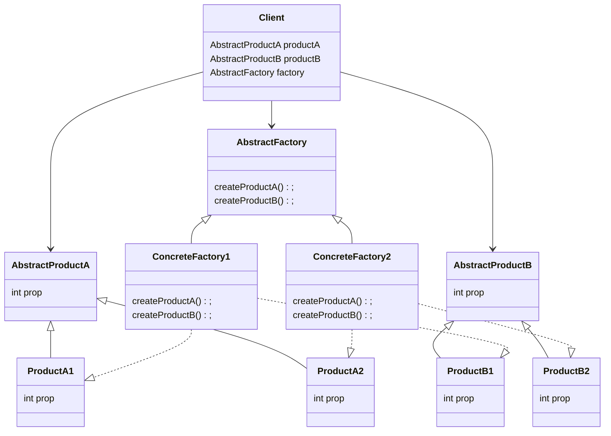

# Abstract Factory Pattern

**Book definition**: Provide an interface for creating families of related or dependent objects without specifying their concrete classes.

The abstract factory pattern provides us a way of handling groups of objects that are conceptually dependent of each other in a way that allow for replacement of the whole group. This is accomplished by hiding their concrete classes' implementations and relying on factory classes for each subclass implementation.

For instance: Imagine that we are building an application that should work on multiple mobile operational systems. This application would have a set of widgets for each OS, such as `Button`, `TextBox`, `View`, etc. We could simply go and create each of those for each operational system, but how do we make sure that the correct button would be displayed in the correct OS, for example? We could end up with an Android button being displayed in an iOS.

Concrete factories could help here: we could isolate the creation of the elements in each factory, split by operational system (`AndroidWidgetFactory`, `iOSWidgetFactory`, etc), these factories would inherit from a base `WidgetFactory`. Additionally, we could instantiate the correct factory at compile time and make sure only one instance of it can be created (using the Singleton Pattern).

## Structure

Below we have the class diagram representing the pattern structure:



## How-To

Following up on the widgets example above, we could have an implementation like this:

- Abstract widgets:

```csharp
  public abstract class Button : Drawable { }
  public abstract class TextBox : Drawable { }
  public abstract class View : Drawable { }
```

- Android widgets:

```csharp
public class AndroidButton : Button { }
public class AndroidTextBox : TextBox { }
public class AndroidView : View { }
```

- iOS widgets:

```csharp
public class IOSButton : Button { }
public class IOSTextBox : TextBox { }
public class IOSView : View { }
```

- Abstract factory:

```csharp
public abstract class WidgetFactory
{
public abstract Button MakeButton();

public abstract TextBox MakeTextBox();

public abstract View MakeView();
}
```

- Concrete Android factory:

```csharp
public class AndroidWidgetFactory : WidgetFactory
{
public override Button MakeButton() => new AndroidButton();

public override TextBox MakeTextBox() => new AndroidTextBox();

public override View MakeView() => new AndroidView();
}
```

- Concrete iOS factory:

```csharp
public class IOSWidgetFactory : WidgetFactory
{
public override Button MakeButton() => new IOSButton();

public override TextBox MakeTextBox() => new IOSTextBox();

public override View MakeView() => new IOSView();
}

```

## Working example

As working examples, we have two implementations: the first is a use case extracted from GoF's book, a Maze Game. The second one is extracted from the example in Head First Design Patterns, an Ingredient Factory implementation for the Pizza Store (expanded from the [Factory Method Pattern](../factory-method/)). Each of them are detailed below.

### Maze Game

In this game we would like to create different kinds of maze (simple, enchanted, bombed) and we want to hide tbe details of which concrete class that's being created, so the calling code could simply say "create this item", and the item would be created accordingly to its concrete factory.

To accomplish this, I've created an abstract `MazeFactory` class, which is inherited by `BombedMazeFactory`, `EnchantedMazeFactory` and `SimpleMazeFactory`. As you can guess, `SimpleMazeFactory` returns regular objects, whilst `BombedMazeFactory` and `EnchantedMazeFactory` return stylized items according to its names.

The implementation itself is quite extensive and can be viewed at the `maze-game` solution in this directory, but the final result looks like this:
Code:

```csharp
public class Program
{
  public static void Main(string[] args)
  {
    var enchantedMaze = new MazeGame().CreateMaze(new EnchantedMazeFactory());
    Console.WriteLine("Using enchanted factory:");
    enchantedMaze.Draw();

    var bombedMaze = new MazeGame().CreateMaze(new BombedMazeFactory());
    Console.WriteLine("Using bombed factory:");
    bombedMaze.Draw();

    var simpleMaze = new MazeGame().CreateMaze(new SimpleMazeFactory());
    Console.WriteLine("Using simple factory:");
    simpleMaze.Draw();
  }
}

```

Output:

```bash
Using enchanted factory:
✨✨✨✨✨🪞✨✨✨✨✨
✨..................✨
✨..................✨
✨..................✨
🪞..................✨
✨..................🪞
✨..................✨
✨..................✨
✨..................✨
✨✨✨✨✨🪞✨✨✨✨✨
Using bombed factory:
💣💣💣💣💣🪟💣💣💣💣💣
💣..................💣
💣..................💣
💣..................💣
🪟..................💣
💣..................🪟
💣..................💣
💣..................💣
💣..................💣
💣💣💣💣💣🪟💣💣💣💣💣
Using simple factory:
----------🚪----------
|..................|
|..................|
|..................|
🚪..................|
|..................🚪
|..................|
|..................|
|..................|
----------🚪----------
```

Notice that we are passing different concrete factories to the class responsible for putting the maze pieces together: `MazeGame`. The method `CreateMaze()` receives a parameter of type `MazeFactory`, so we can pass any concrete subclass and it would create the instances of `Wall`, `Door`, `Room` and `Maze` accordingly.
