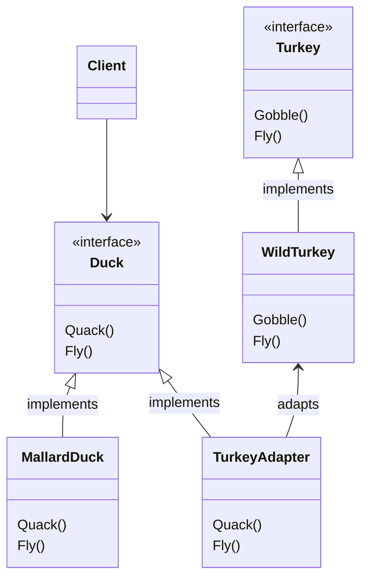

# Duck Adapter

In the class diagram below you can see the Adapter Pattern in play: In this example, the `TurkeyAdapter` class implements the `Duck` interface, expected by the `Client`, and delegates the requests to the adaptee (`WildTurkey`). Notice that in the implementation, one of the methods had to be changed slightly by the adapter itself before delegating the call to the adaptee.

