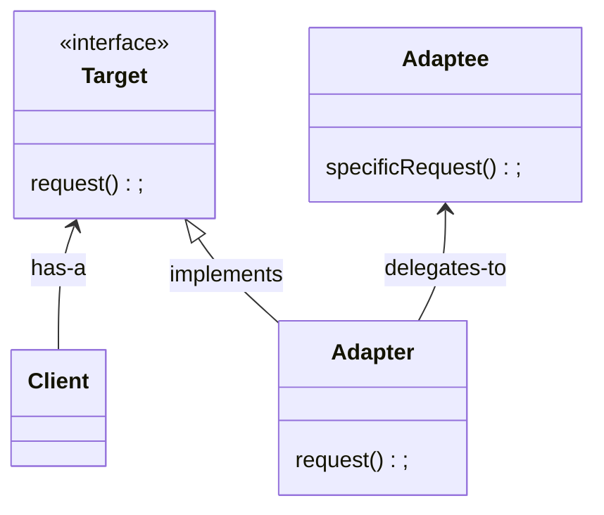

# Adapter Pattern

The adapter pattern provides us with a way to create alternative interface representations of objects to be used in places where another, possibly incompatible interface is expected.

## Structure

## Working example

As it looks like I'm not creative enough and the authors of Head-First Design Patterns, in this case, were not that creative as well, the working example is pretty simple: We have a `Duck` interface and a `Turkey` interface, and we adapted a `Turkey` object to behave like a `Duck`. Check out [duck-adapter](./duck-adapter/) for implementation details.
