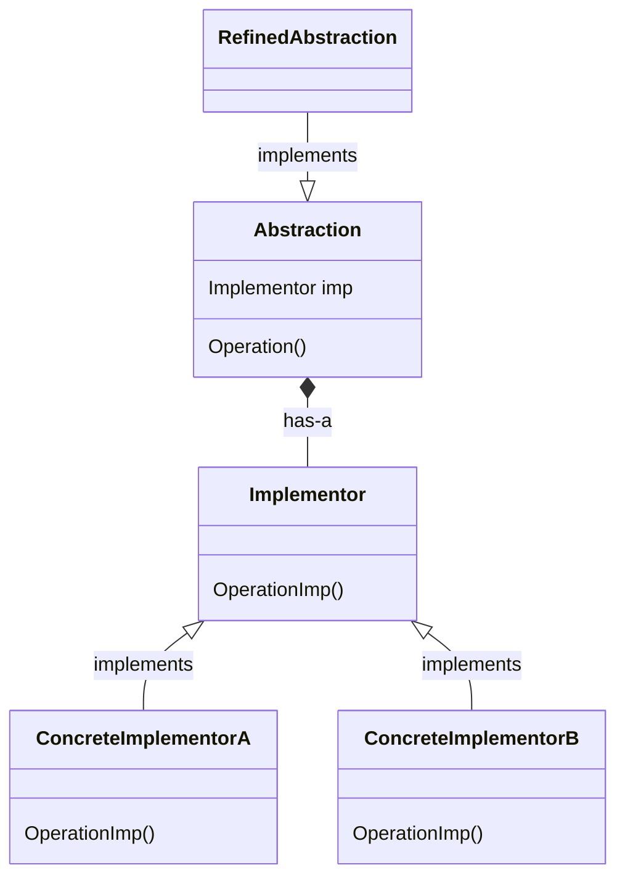

# Bridge

Decouple an abstraction from its implementation so that the two can vary independently.

## Structure

```mermaid
classDiagram

class Implementor {
    OperationImp()
}

class ConcreteImplementorA {
    OperationImp()
}

class ConcreteImplementorB {
    OperationImp()
}

class Abstraction {
    Implementor imp
    Operation()
}

class RefinedAbstraction
Abstraction *-- Implementor : has-a
Implementor <|-- ConcreteImplementorA : implements
Implementor <|-- ConcreteImplementorB : implements
RefinedAbstraction --|> Abstraction : implements
```
