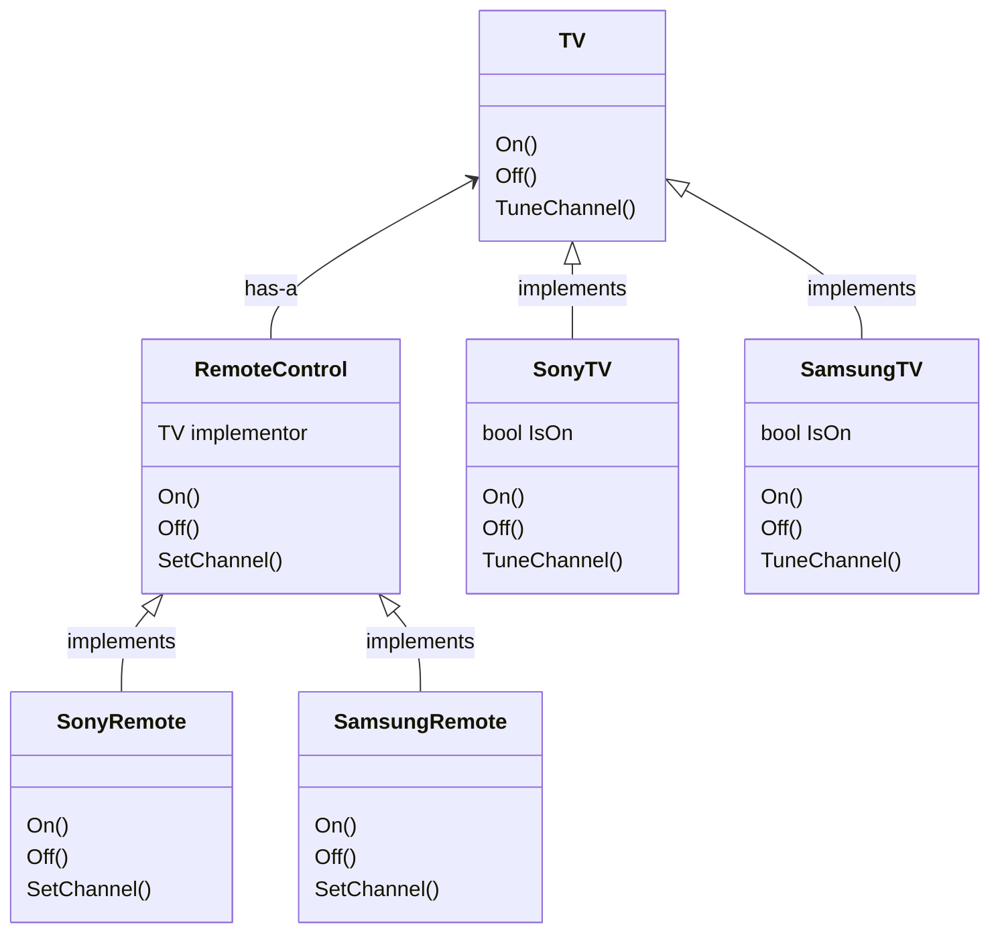

# Universal remote control

This project focuses on exposing a universal interface for a remote control. It detaches the abstraction of the remote control of its many implementations, allowing them to vary independently.

## Class diagram

