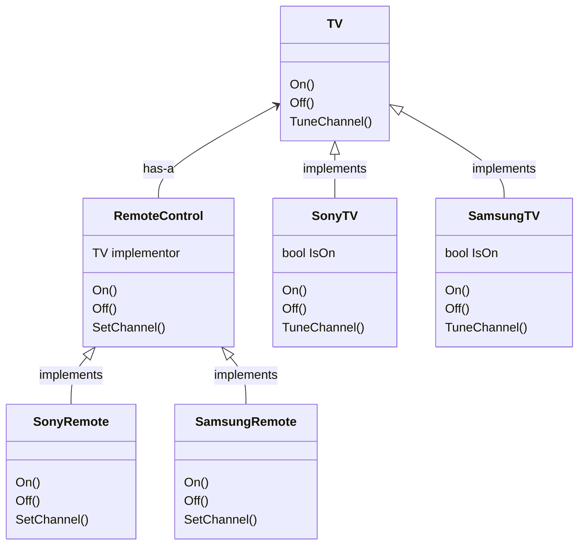

```mermaid
classDiagram

class TV {
    On()
    Off()
    TuneChannel()
}
class RemoteControl {
    TV implementor
    On()
    Off()
    SetChannel()
}

class SonyTV {
    bool IsOn
    On()
    Off()
    TuneChannel()
}

class SamsungTV {
    bool IsOn
    On()
    Off()
    TuneChannel()
}

class SonyRemote {
    On()
    Off()
    SetChannel()
}

class SamsungRemote {
    On()
    Off()
    SetChannel()
}

TV <|-- SonyTV : implements
TV <|-- SamsungTV : implements
RemoteControl <|-- SonyRemote : implements
RemoteControl <|-- SamsungRemote : implements
TV <-- RemoteControl : has-a
```
