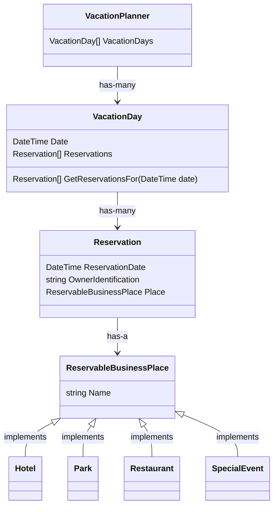
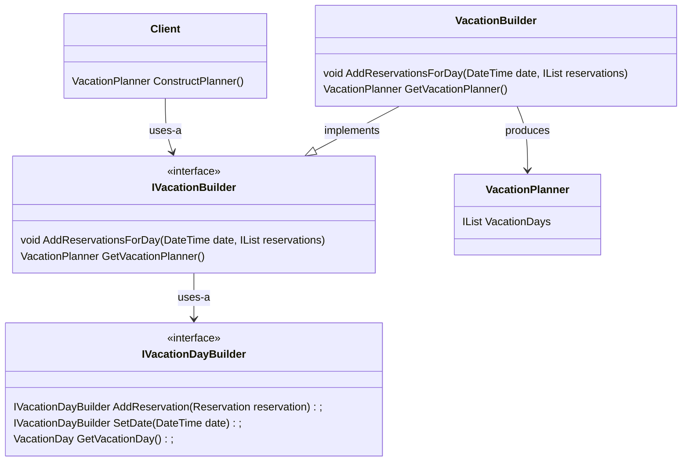

# Patternsland

`Patternsland` is a hypothetical vacation planner system which allows clients to configure vacation days based on their interests. The system is roughly based on reservations attached to specific vacation days. A reservation basically stores a date and binds it to a specific business place, be it a park, hotel or restaurant. Reservations also keep track of the identification document of its owner. A `VacationDay`, then, is defined as a class containing many reservations for a specific date, and a `VacationPlanner` is therefore defined as the aggregate of many `VacationDay`s.

## Reservations

The `Reservation` class was meant to be as flexible as possible, allowing for different business places to be attached to it without an explosion of subclasses. To accomplish that, a `ReservableBusinessPlace` abstract class was put in place, so all the places that are reservable can easily extend this class and inherit the ability to be bound to a `Reservation` object. See the class diagram below for details on how these classes relate to each other:



## The Builder pattern applied

The **Builder Pattern** was applied to this project to encapsulate the way that `VacationPlanner`s are created and the way their underlying `VacationDay`s are configured, which allows for clients to easily create a planner based on some dates and a few reservations. Check the class diagram below for a detailed understanding of how these classes relate to each other:



As you may have noticed, there is also a sub-builder called `VacationDayBuilder` which allows the `VacationBuilder` itself to construct `VacationDay`s in an easier and more straightforward way. `VacationDayBuilder` is a different builder flavour, it's what's called a Fluent Builder. Fluent because it allows us to chain calls to its methods, almost creating a text sentence expressing the intention of the client when using it. A good example of it in practice is shown below:

```csharp
var vacationDay = new VacationDayBuilder()
    .SetDate(date)
    .AddReservation(parkReservation)
    .GetVacationDay();
```

I personally prefer this kind of approach, even for complex objects, as it allows you to be completely specific about the fields you want in the final object, ignoring optionals when applicable.

### VacationBuilder usage

A typical usage for the `VacationBuilder` would involve defining a `date`, instantiating the builder and pointing it to the selected date, creating some `reservations` and attaching them to the builder and, finally, asking for the resulting `Planner` object. The code below is a good picture of this idea:

```csharp
var date = DateTime.Now;
var ownerIdentification = "PP1234";
var park = new Park(name: "Patternsland");
var hotel = new Hotel(name: "Grand Facadian");
var reservations = new List<Reservation>()
{
    new Reservation(date, ownerIdentification, place: park),
    new Reservation(date, ownerIdentification, place: hotel),
};

var builder = new VacationBuilder();
builder.AddReservationsForDay(date, reservations);

var planner = builder.GetVacationPlanner();
```

In the code above, an user would have a reservation for today and this reservation would include the Grand Facadian hotel and the Patternsland park.

## Testing

Unit tests were put in place, specially to cover the behavior of the existing builders. A sample test looks like:

```csharp
public class VacationDayBuilderTest
{
  // code...

  [Fact]
  public void TestBuildsVacationDayWithOneReservation()
  {
    var date = DateTime.Now;
    var builder = new VacationDayBuilder();
    var parkReservation = new Reservation(
      reservationDate: date,
      ownerIdentification: "1234",
      place: new Park(name: "Patternsland")
    );

    builder.SetDate(date);
    builder.AddReservation(parkReservation);

    var vacationDay = builder.GetVacationDay();

    var reservationForVacationDay = vacationDay.GetReservationsFor(date);

    Assert.Collection(
      reservationForVacationDay,
      createdReservation =>
      {
        Assert.Equal(createdReservation.Place.Name, parkReservation.Place.Name);
        Assert.Equal(createdReservation.ReservationDate, parkReservation.ReservationDate);
      }
    );
  }
```

Check [Patternsland.DomainTests](./Patternsland.DomainTests/) for the full Domain test suite.
