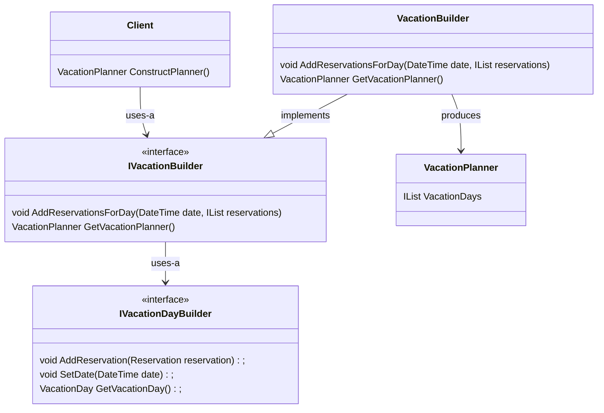
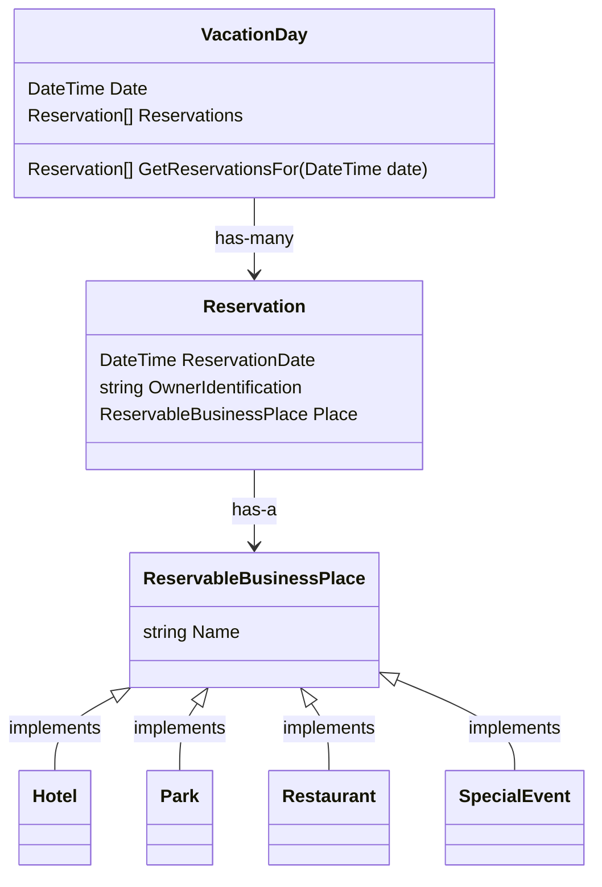

- Builders:

```mermaid
classDiagram

class IVacationBuilder {
    void AddReservationsForDay(DateTime date, IList<Reservation> reservations)
    VacationPlanner GetVacationPlanner()
}
<<interface>> IVacationBuilder

class IVacationDayBuilder {
    void AddReservation(Reservation reservation);
    void SetDate(DateTime date);
    VacationDay GetVacationDay();
}

<<interface>> IVacationDayBuilder

class VacationPlanner {
    IList<VacationDay> VacationDays
}

class VacationBuilder {
    void AddReservationsForDay(DateTime date, IList<Reservation> reservations)
    VacationPlanner GetVacationPlanner()
}

class Client {
    VacationPlanner ConstructPlanner()
}

Client --> IVacationBuilder : uses-a
IVacationBuilder --> IVacationDayBuilder : uses-a
VacationBuilder --|> IVacationBuilder : implements
VacationBuilder --> VacationPlanner : produces
```

- Reservations:

```mermaid
classDiagram

class ReservableBusinessPlace {
    string Name
}

class Hotel
class Park
class Restaurant
class SpecialEvent

class VacationDay {
    DateTime Date
    Reservation[] Reservations
    Reservation[] GetReservationsFor(DateTime date)
}

class Reservation {
    DateTime ReservationDate
    string OwnerIdentification
    ReservableBusinessPlace Place
}

VacationDay --> Reservation : has-many
Reservation --> ReservableBusinessPlace : has-a
ReservableBusinessPlace <|-- Hotel : implements
ReservableBusinessPlace <|-- Park : implements
ReservableBusinessPlace <|-- Restaurant : implements
ReservableBusinessPlace <|-- SpecialEvent : implements
```
