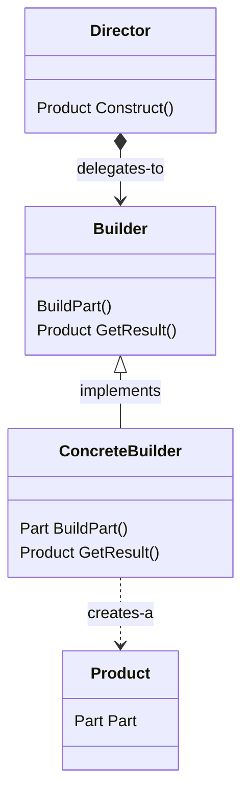

# Builder Pattern

The builder pattern provides a way to abstract away the complexities of instantiating objects, allowing classes to change independently and in a more flexible fashion without impacting many clients.

## Structure

The **Builder Pattern** has many flavours and its structure may vary drastically depending on the approach taken by the engineer/ team implementing it, but the most common understanding of it involves a client (`Director`) delegating to a `Builder` the task of `Construct`ing a `Product`. In a good OO fashion, the `Builder` itself is probably just an interface, implemented by a `ConcreteBuilder` somewhere in the system and injected back into the `Director` at instantiation time. The delegation itself involves asking the `Builder` to `BuildPart`s of the complex `Product` being built. Then, once the `Director` is done with its specifications regarding the product, it simply calls `GetResult` on the `Builder` to get the final `Product`. The class diagram below shows how these classes interact with each other and sheds some light on this explanation:

## Working example

A hypothetical vacation planning system was implemented as the working example for this pattern, it's inspired by the brief description presented in the Builder Pattern Description section in the Head First Design Patterns book. This system is responsible for allowing users to plan their vacations, defining reservations for the places they want to visit and defining specific dates for such visits. For the detailed explanation on how the builder pattern was used in this project, please refer to [Patternsland](./Patternsland).
