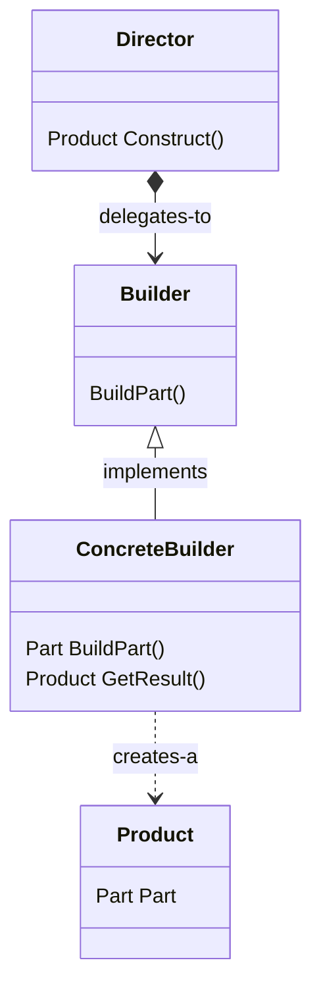

# Builder Pattern

The builder pattern provides a way to abstract away the complexities of instantiating objects, allowing classes to change independently and in a more flexible fashion without impacting many clients.

**Book definition:** Separate the construction of a complex object from its representation so that the same construction process can create different representations.

## Structure

Below we can find a class diagram of the pattern:



Notice that a `Director` has a method to `Construct()` the `Product`, but it delegates this task to the `Builder`. The builder in this case is a `ConcreteBuilder`, that allows for building parts gradually until the desired result is achieved. Then, the `Director` only needs to call `GetResult()` to get hold of the product just built.

## How-To

A builder is commonly a class that's specialist in creating a particular kind of object, so we commonly have the following group of classes working together:

```csharp
class Part {
  public Part() {}
}

class Product {
  public Product() {}

  public void AddPart(Part part)
  {
    this._part = part;
  }
}

class ProductBuilder {
  public ProductBuilder()
  {
    this._currentProduct = new Product();
  }

  public void buildPart()
  {
    this._currentProduct.AddPart(new Part());
  }

  public Product getProduct()
  {
    return this._currentProduct;
  }
}
```

## Working examples

There are two simple examples to exercise this pattern. The first one is a [VirtualBookshelf](./VirtualBookshelf/), which implements a slightly modified version of the Builder Pattern: the fluent builder. The second one is a VacationBuilder, which implements a builder for a composite `Vacation` object.

**VirtualBookshelf**

This project implements a book builder in a slightly different fashion: Our builder is going to be fluent. The main difference between a regular builder and a fluent one is that it keeps returning itself until the `Build()` method is called (check out the sequence diagram at the project's README for more details), this allows for method chaining in a graceful way while keeping all the part-building approach working as in the regular ones.

Our book is going to have the following fields:

- ISBN
- Title
- Author
- Distributor
- Price

And the result would look like this:

```csharp
    var result = new BookBuilder()
      .From(author)
      .By(publisher)
      .WithTitle(title)
      .WithISBN(isbn)
      .WithPrice(price)
      .Build();
```
