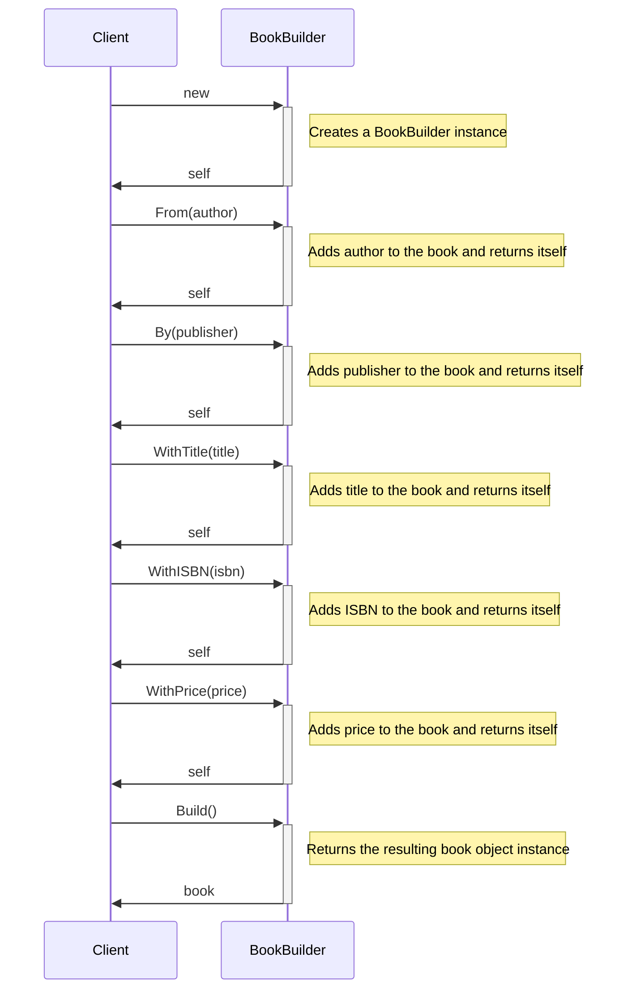

# Virtual Bookshelf

This is a simple project to demonstrate the usage of a fluent builder. In this example, we're going to build a book part by part, using a builder, and we are going to retrieve the final product by calling `builder.Build()`.

## Sequence diagram

