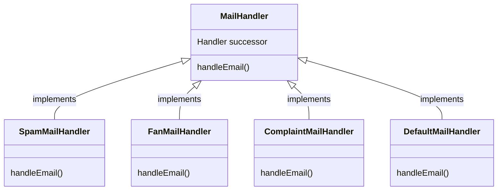
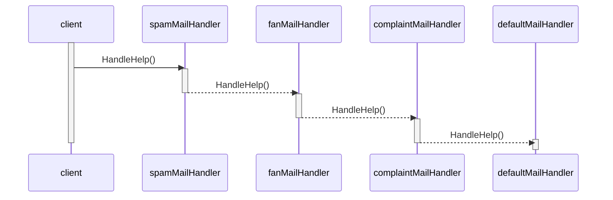

```mermaid
classDiagram

class MailHandler {
    Handler successor
    handleEmail()
}

class SpamMailHandler {
    handleEmail()
}

class FanMailHandler {
    handleEmail()
}

class ComplaintMailHandler {
    handleEmail()
}

class DefaultMailHandler {
    handleEmail()
}

MailHandler <|-- SpamMailHandler : implements
MailHandler <|-- FanMailHandler : implements
MailHandler <|-- ComplaintMailHandler : implements
MailHandler <|-- DefaultMailHandler : implements
```

```mermaid
sequenceDiagram
    participant client
    participant spamMailHandler
    participant fanMailHandler
    participant complaintMailHandler
    participant defaultMailHandler
    activate client

    client->>spamMailHandler: HandleHelp()
    activate spamMailHandler
    spamMailHandler-->>fanMailHandler: HandleHelp()
    deactivate spamMailHandler
    activate fanMailHandler
    fanMailHandler-->>complaintMailHandler: HandleHelp()
    deactivate fanMailHandler
    activate complaintMailHandler
    complaintMailHandler-->>defaultMailHandler: HandleHelp()
    deactivate complaintMailHandler
    activate defaultMailHandler
    deactivate defaultMailHandler
    deactivate client
```
