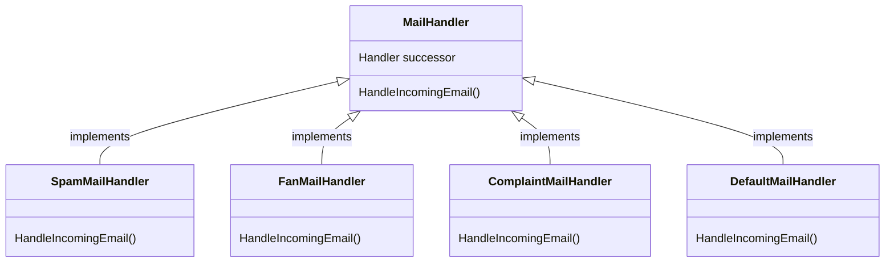
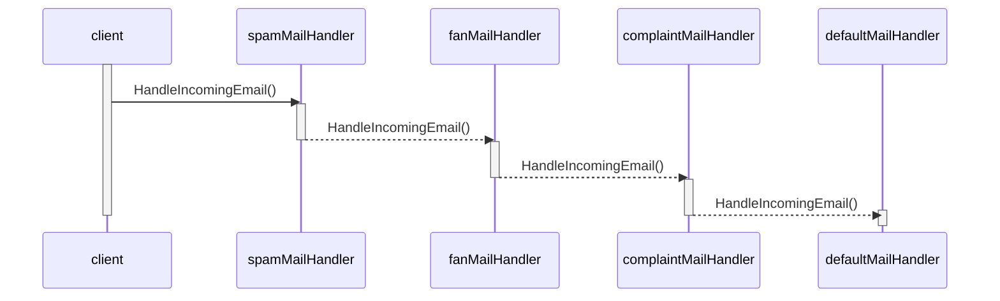

# MightyGumballMailing

MightyGumballMailing is a hypothetical system responsible for handling incoming emails towards the MightyGubmall organization, its main purpose is to check the email type and perform appropriate actions according to each type. For simplicity and completeness, let's imagine that there's an existing AI system categorizing the emails by type before feeding them into `MightyGumballMailing`.

The system is ready to handle three types of email:

- Complaint: any complaints regarding the platform or their products. Email of this type should be forwarded to the Legal department;
- Fan: any email recognizing how amazing MightyGumball is and how their product changed their lives. Emails of this type should be forwarded to the CEO;
- Spam: any email tagged as spam by the IA. Emails of this type should be moved to the Junk folder.

Additionally, if the email its type defined as `UNKNOWN` by the AI, then it's going to be moved to the Inbox folder for human analysis later.

## The Chain of Responsibility Pattern applied

With the above description in mind, a `MailHandler` interface was created. It's definition is straightforward:

```csharp
public interface MailHandler
{
  void HandleIncomingEmail(Email email);
}
```

It contains a `HandleIncomingEmail` method, which is self explanatory. Specific mail handlers implement this interface and add logic to deal with their specific email types. If it happens for the email not to be that handler's responsibility, it delegates the responsibility to its successor. `MailHandler` classes are structured as follows:



This structure is flexible in a way that it allows for the chaining of handlers, reminding us of a linked list of some sort. Each handler implementation that contains a successor can be arbitrarily defined as the start of the chain.

As per design, `DefaultMailHandler` is chosen to be the end of the chain, hence why it doesn't have any successors. This basically defines that if an e-mail goes through the whole chain and is not handled, it's guaranteed that it would be moved to the Inbox folder.

The sequence diagram below shows how a client interacts with the mail handling responsibility chain:



And the code below (also present in the [sample Console App for this project](./MightyGumballMailing.ConsoleApp/Program.cs)) shows how a chain can be configured to handle a list of incoming emails:

```csharp
var mailService = new FakeMailService();
var defaultMailHandler = new DefaultMailHandler(mailService);
var complaintMailHandler = new ComplaintMailHandler(mailService, successor: defaultMailHandler);
var fanMailHandler = new FanMailHandler(mailService, successor: complaintMailHandler);
var spamMailHandler = new SpamMailHandler(mailService, successor: fanMailHandler);

emails.ForEach(email => spamMailHandler.HandleIncomingEmail(email));
```

This decoupling of the handler of a given request from it's initiator helps avoiding large and complex switch statements, although it adds considerable complexity and a potential for the creation of a large number of implementation classes.

## Testing

Simple unit tests were added to cover the behavior of each handler and the way they delegate the calls to their successors when applicable. To keep the scope short enough and the tests as precise as possible, `Moq` was used to mock the behavior of `MailService`. A simple test for a handler would look like this:

```csharp
[Fact]
  public void TestHandlesComplaintEmail()
  {
    var mockedMailSvc = new Mock<MailService>();
    var mockedSuccessorMailHandler = new Mock<MailHandler>();
    var email = new Email(
      // email props defined here
    );

    var handler = new ComplaintMailHandler(
      mailService: mockedMailSvc.Object,
      successor: mockedSuccessorMailHandler.Object
    );

    handler.HandleIncomingEmail(email);

    mockedMailSvc.Verify(instance => instance.ForwardToLegalDepartment(email), Times.Once());
  }

  [Fact]
  public void TestDoesNothingIfEmailTypeIsNotComplaintAndThereIsNoSuccessor()
  {
    var mockedMailSvc = new Mock<MailService>();
    var email = new Email(
      // email props defined here
    );

    var handler = new ComplaintMailHandler(mailService: mockedMailSvc.Object, successor: null);

    handler.HandleIncomingEmail(email);
  }

  [Fact]
  public void TestDelegatesHandlingToSuccessorIfMailTypeIsNotComplaint()
  {
    var mockedMailSvc = new Mock<MailService>();
    var mockedSuccessorMailHandler = new Mock<MailHandler>();
    var email = new Email(
      // email props defined here
    );

    var handler = new ComplaintMailHandler(
      mailService: mockedMailSvc.Object,
      successor: mockedSuccessorMailHandler.Object
    );

    handler.HandleIncomingEmail(email);

    mockedSuccessorMailHandler.Verify(instance => instance.HandleIncomingEmail(email), Times.Once());
  }
```

The code above implements tests to cover the happy path for when the email has the handler's expected type (`Complaint` in this case) and makes sure that it calls the correct method on `MailService` to `ForwardToLegalDepartment`. Another test was added to cover the case when for some reason a successor isn't specified for `ComplaintHandler`, and a third test was added to make sure that the successor is being invoked correctly when the email type is different than the one the that handler is able to handle.
