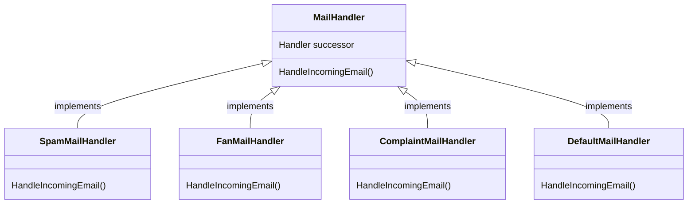
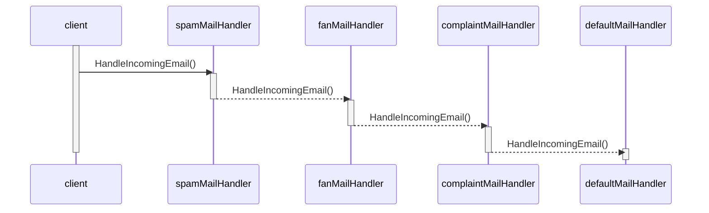

🚧 **This repository is a work in progress and is being constantly updated. Stay tuned and don't mind the mess!** 🚧

# MightyGumballMailing

MightyGumballMailing is a hypothetical system responsible for handling incoming emails towards the MightyGubmall organization, its main purpose is to check the email type and perform appropriate actions according to each type. For simplicity and completeness, let's imagine that there's an existing AI system categorizing the emails by type before feeding them into `MightyGumballMailing`.

- Handler classes are structured as follows:

- The sequence diagram below shows how a client interacts with the mail handling responsibility chain:

