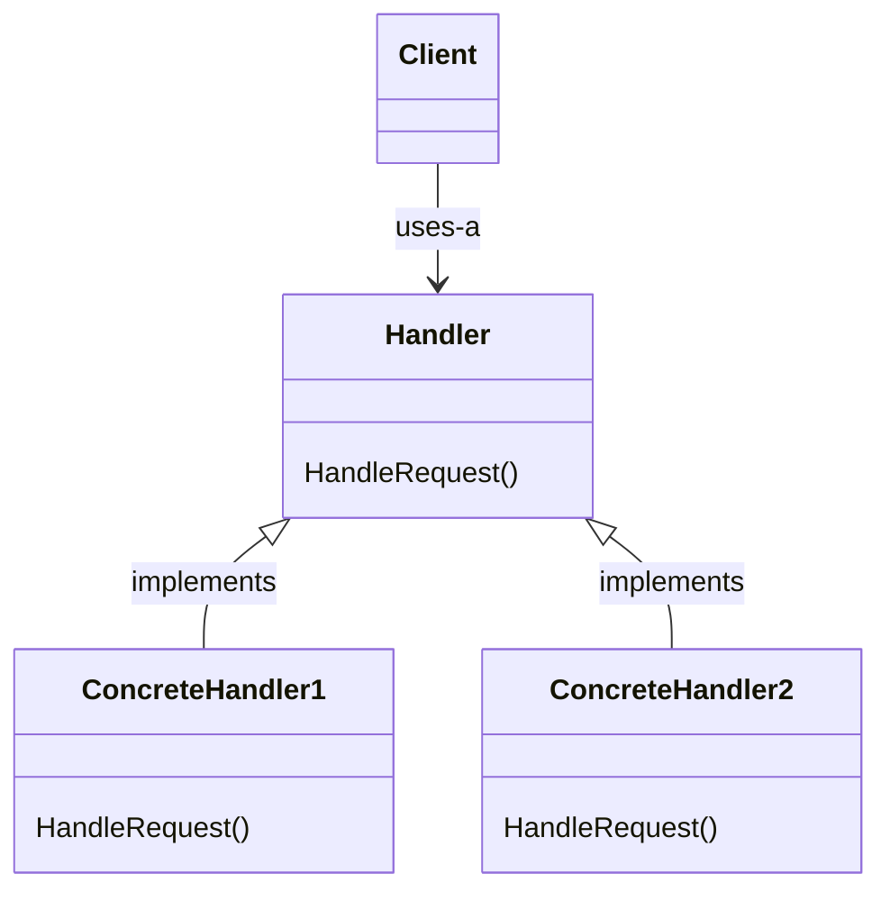

# Chain of Responsibility

```mermaid
classDiagram

class Client
class Handler {
    HandleRequest()
}

class ConcreteHandler1 {
    HandleRequest()
}

class ConcreteHandler2 {
    HandleRequest()
}

Client --> Handler : uses-a
Handler <|-- ConcreteHandler1 : implements
Handler <|-- ConcreteHandler2 : implements
```
