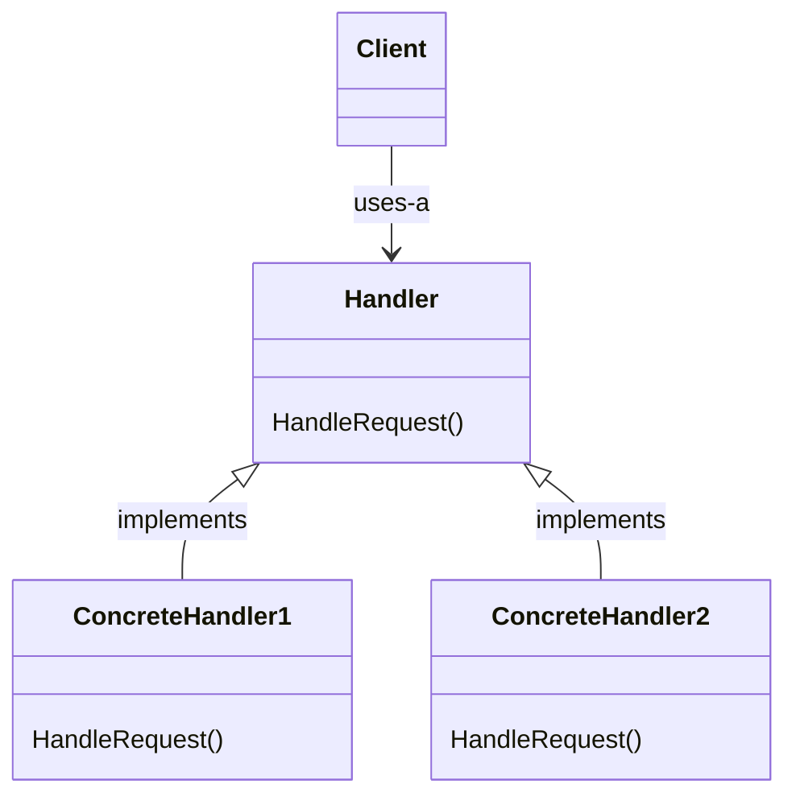

# Chain of Responsibility

The **Chain of Responsibility Pattern** helps avoid coupling the sender of a request to its receiver by giving more than one object a chance to handle the request. Chain the receiving objects and pass the request along the chain until an object handles it.

## Structure

The general structure for the pattern includes a `Client` that initiates the request, a `Handler` interface, which is responsible for defining the methods that each handler in the chain will be implementing, and the `ConcreteHandler`s that will be implementing the `Handler` interface to be able to answer to the `Client`. The class diagram below shows this structure in more detail:

## Working example

The working example for this project is a mailing classification system, responsible for handling different types of email: Spam, Fan and Complaint. Each kind of e-mail needs to be handled differently and the system uses the **Chain of Responsibility Pattern** to chain each handler, defaulting to a `DefaultMailHandler` if none of the previous handlers were able to deal with the incoming e-mail. Check out the [MightyGumballMailing](./MightyGumballMailing/) project for more details on the project and on how the pattern was applied.
