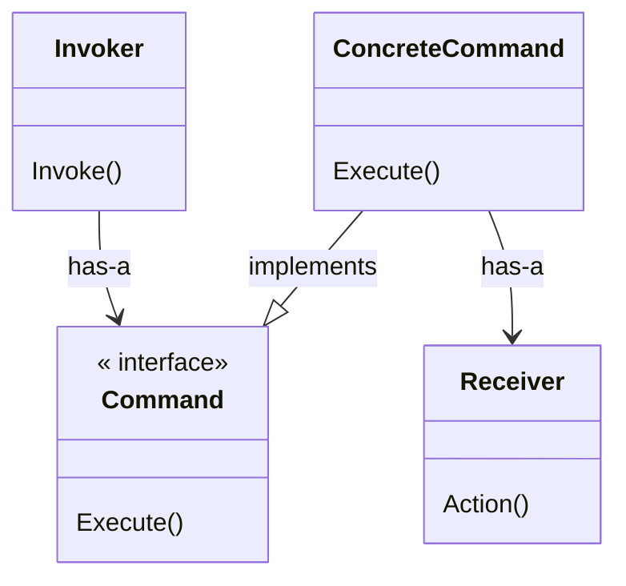

# Command Pattern

**Book definition:** The Command Pattern encapsulates a request as an object, thereby letting you parameterize other objects with different requests, queue or log requests, and support undoable operations.

## Structure

## Working example

As a working example I've implemented a `RemoteControl` that is meant to be generic, accepting instructions passed in as a `Command` object. The `RemoteControl` knows nothing about the action being executed, as the `Command` object abstracts the call to the `Receiver`. The `RemoteControl` only needs to call `Execute()` on the `Command` passed in.

The remote control has 7 slots, each slot accepts a "on" and a "off" command. There's also a global `Undo()` method to allow to take back the last command executed. For implementation details, please have a look at the `home-automation-inc` directory.
