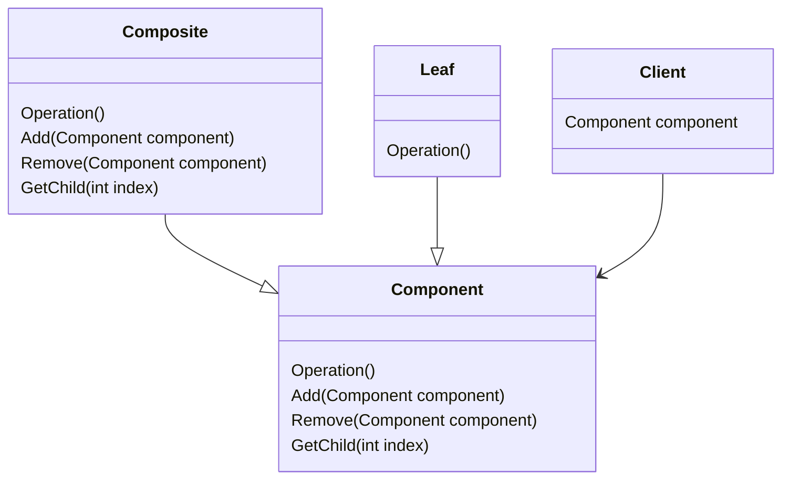

# Composite Pattern

The composite pattern provides a solution for grouping composable objects that share a common operation under a single interface, so we can handle different levels of composition without worrying whether the object in hand is a primitive or a composite. Composite objects generally keep a list of children.

## Structure

Below we can find the class diagram for the pattern:

Notice that a `Client` has a `Component`, this component could be either a `Leaf` or a `Composite`, but the client does not really know, as both of those are implementing the same shared `Component` interface.

## Working example
