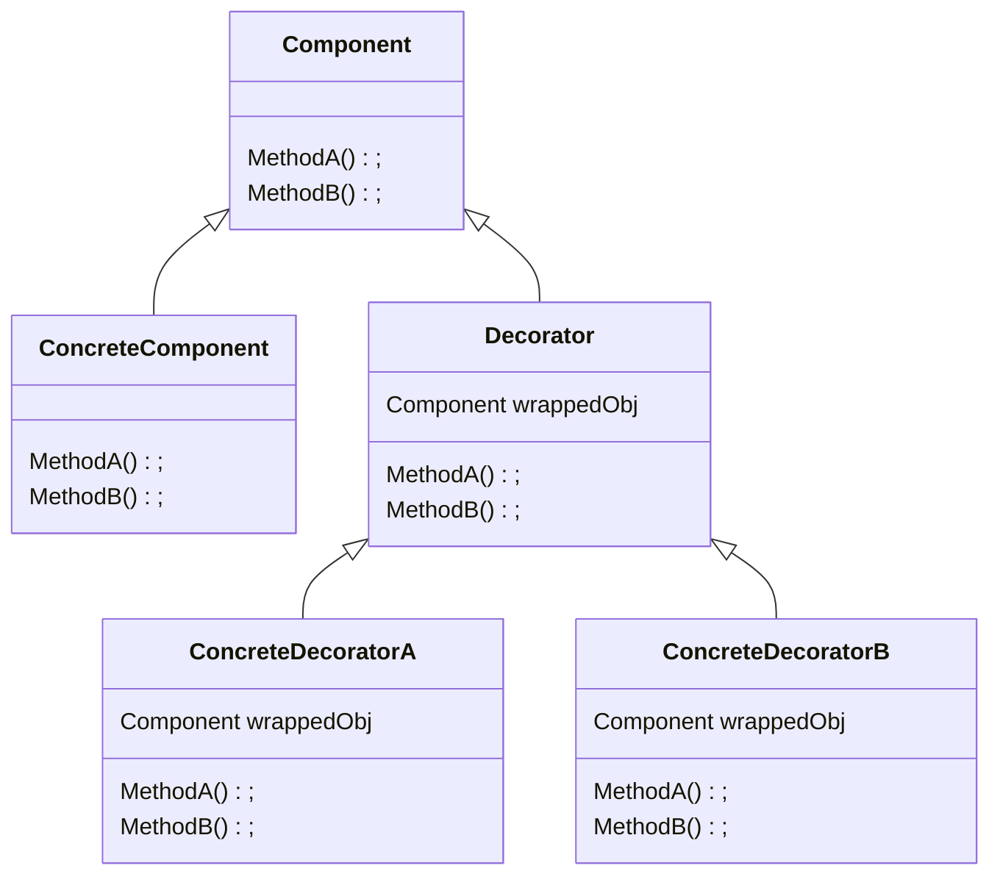

# Decorator Pattern

The decorator pattern allow us to compose objects while keeping the same top-level interface, thus allowing for enhancing the behavior of the target objects in a flexible and run-timleable way.

**Book definition**: The Decorator Pattern attaches additional responsibilities to an object dynamically. Decorators provide a flexible alternative to subclassing for extending functionality.

## Structure



A client here would the `Component` without knowing wether it's a simple `ConcreteComponent` or a decorated one, because both of them implements the same abstract interface. Additionally, the decorator components (`ConcreteDecoratorA` and `ConcreteDecoratorB`) would implement their logic before or after calling `MethodA()` or `MethodB()` and the client would treat the result the same way.

## Working example

For our working example, we are going to implement the beverages menu for Starbuzz Coffee. Currently, there are four types of base coffees and four types of condiments. Multiple condiments can be added to a base coffee, in any order.

```bash
+-------------------+
| Coffees           |
| - House Blend .89 |
| - Dark Roast .99  |
| - Decaf 1.05      |
| - Expresso 1.99   |
|                   |
| Condiments        |
| - SteamedMilk .10 |
| - Mocha .20       |
| - Soy .15         |
| - Whip .10        |
+-------------------+
```
