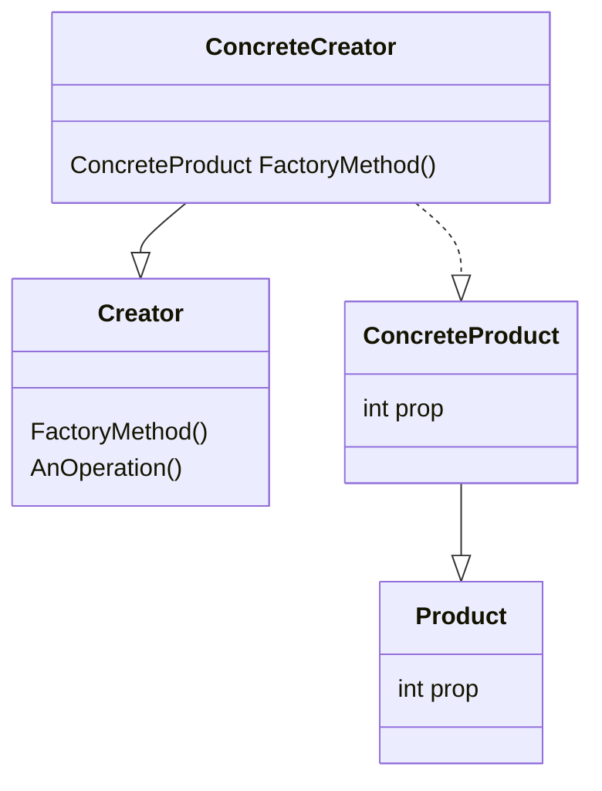

# Factory method pattern

The factory method pattern provides us a way to delegate the creation of objects to subclasses, while keeping the intent of the superclass clear.

## Structure



Notice that a `Creator` resorts to a `FactoryMethod()` so it can create the `Product`, but each `ConcreteCreator` should implement the `FactoryMethod()` to return the correct `ConcreteProduct` for the context.

## How-To

- The abstract class for the product we want to create

```csharp
class Product {}
```

- The concrete class of the product we want to create, may be multiple ones

```csharp
class ConcreteProduct : Product {}
```

- The creator class that holds the factory method

```csharp
class Creator
{
  protected virtual Product FactoryMethod();

  void AnOperation()
  {
    var product = FactoryMethod();
  }
}
```

- The concrete creator class, that implements the factory method

```csharp
class ConcreteCreator : Creator
{
  protected override Product FactoryMethod()
  {
    return new ConcreteProduct();
  }
}
```

## Working example

For our working example we are going to implement a `PizzaStore`. This pizza store will be responsible for taking orders and it knows all the steps to prepare, bake, cut and box the pizzas. Our `Pizza`'s, though, may have many different styles and types, that's where the Factory Method pattern comes in handy: We can subclass `PizzaStore` to isolate only the bit that varies (the `Pizza` itself, encapsulated in a factory method called `CreatePizza`), while also keeping all the implementation at the abstract, base class. We will need to also make `Pizza` abstract, so we can create subclasses of it to return at each store.

The final implementation will look like this:

- The base PizzaStore

```csharp
public abstract class PizzaStore
{
  protected abstract Pizza CreatePizza(PizzaTypes type);  // Factory method

  public Pizza Order(PizzaTypes type)
  {
    var pizza = CreatePizza(type);
    pizza.Prepare();
    pizza.Bake();
    pizza.Cut();
    pizza.Box();
    return pizza;
  }
}
```

- The concrete PizzaStore for New York:

```csharp
public class NYPizzaStore : PizzaStore
{
  protected override Pizza CreatePizza(PizzaTypes type) // concrete implementation
  {
    return new NYStyleCheesePizza();
  }
}
```

- The concrete PizzaStore for Chicago:

```csharp
public class ChicagoPizzaStore : PizzaStore
{
  protected override Pizza CreatePizza(PizzaTypes type) // concrete implementation
  {
    return new ChicagoStyleCheesePizza();
  }
}
```

Make sure to check out the [PizzaStore](./PizzaStore/) project for full implementation details.
