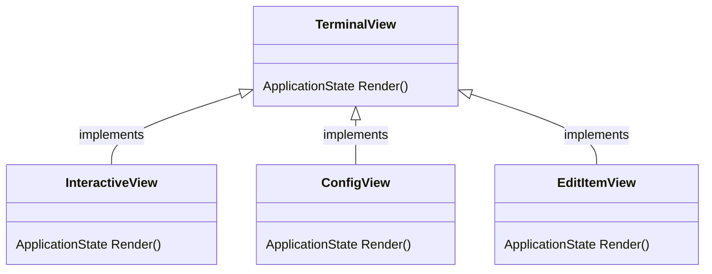

# LandscapeDesign.ConsoleApp

This console application serves as the user interface for this project. When launched, it first goes through a configuration step, asking users to input the size of the square they want rendered in the screen. Then, it moves to an interactive mode, where users can select specific positions and add different symbols to it.

## Views

Different interaction modes are represented by different views in the application. The `Terminal` view class hierarchy is defined as follows:

Each view produces a new `ApplicationState`, an object that records snapshots of the application state between user interactions. `ConfigView` handles the initial setup and can be revisited later, `InteractiveView` handles all the logic of moving positions, editing items and so on. `EditItemView` handles the item edition.

**Demo:** See [demo.mov](../assets/demo.mov) for a video example of it all working.
