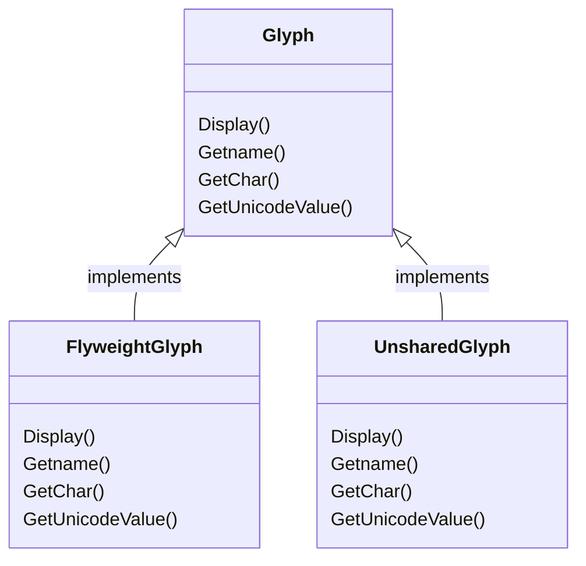

# LandscapeDesign.Domain

This `Domain` project holds the definitions for the main classes and services in the project.

## Glyphs

Glyphs are objects with the ability to draw themselves in a screen. Each glyph holds a unicode emoji and knows how to position this emoji in the symbol map of a screen. Concrete `Glyph` implementations are in fact flyweights, controlled by the `GlyphRegistry`. When custom property needs to be applied to a given glyph (after a user edition, for instance), then the `UnsharedGlyph` instance should be used. The `Glyph` class hierarchy is shown below:

## LandscapeManager

The `LandscapeManager` class manages all interactions with the glyph map, handling operations like inspecting a given glyph in the screen and even editing it afterwards. In the end, it produces a `glyphMap` structure that serves as a template for the screen to render itself.

## Screen

The `Screen` is the class that in fact draws the resulting symbols in the terminal. It has a 2x2 matrix of symbols, each symbol is an emoji. Interactions with the screen are not possible and are forwarded to the `LandscapeManager`, making it just a visual representation of the current state of the application.
