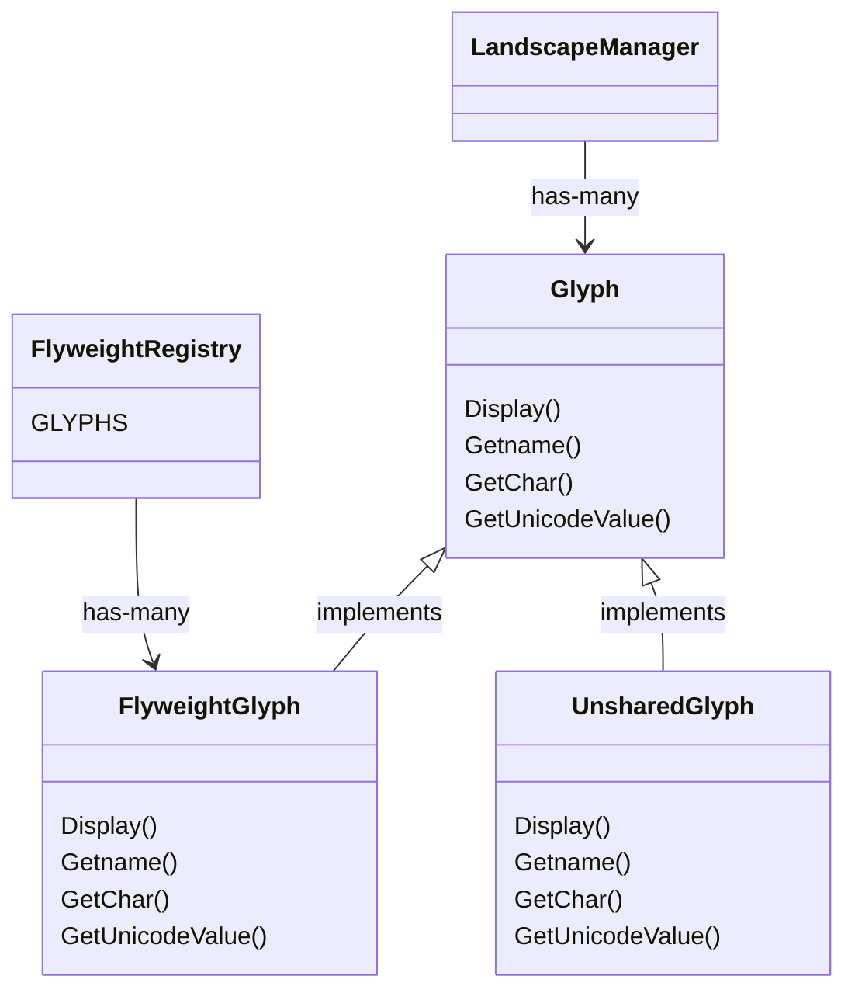

# LandscapeDesign

Landscape design is a hypothetical app that implements a GUI tool for drawing landscapes, all done via the terminal!

## The Flyweight Pattern applied

Landscapes can get complex and very large some times. Imagine a 1000x1000 forest landscape with a house in the middle, for instance. In this example, if each tree in the landscape were a separate object, than memory consumption would be a real concern. To address this problem in the application, the flyweight pattern was used. Each `SupportedGlyph` in the project has a static entry in the `GlyphRegistry`, which takes care of returning the correct `Glyph` object when requested.

The `GlyphRegistry` looks like this:

```csharp
public static class GlyphRegistry
{
  public static Dictionary<SupportedGlyphs, FlyweightGlyph> GLYPHS = new Dictionary<SupportedGlyphs, FlyweightGlyph>()
  {
    { SupportedGlyphs.BROWN_SQUARE, new FlyweightGlyph(character: "🟫", unicodeValue: "U+1F7EB", name: "Brown Square") },
    { SupportedGlyphs.WHITE_SQUARE, new FlyweightGlyph(character: "⬜", unicodeValue: "U+2B1C", name: "White Square") },
    { SupportedGlyphs.TREE, new FlyweightGlyph(character: "🌳", unicodeValue: "U+1F333", name: "Tree") },
    { SupportedGlyphs.HOUSE, new FlyweightGlyph(character: "🏠", unicodeValue: "U+1F3E0", name: "House") },
  };
}
```

And it can be used this way:

```csharp
GlyphRegistry.GLYPHS[SupportedGlyphs.TREE]
```

Notice how each `Glyph` entry in the registry is actually an instance of `FlyweightGlyph`. These flyweight glyphs contain their intrinsic state, like which `character` it should draw, what's the `unicodeValue` of that character and what is its `name`, but they don't make any assumptions around which position of the screen they should occupy, for instance, because it's an extrinsic state that would prevent glyphs of being shared.

With that in mind, when an user adds a tree to their landscape, the application uses the registry to find a match and selects the existing `FlyweightGlyph` instance for the symbol entered, with this approach, every tree in the landscape occupies the space of only one object in memory, the corresponding flyweight glyph for a tree.

When it comes the time to render the glyph in the screen, the screen itself asks the glyph to be displayed and passes itself as a parameter, like in the code below:

```csharp
  public void SetupDisplay(Glyph[][] glyphMap)
  {
    for (int i = 0; i < glyphMap.Length; i++)
    {
      var row = glyphMap[i];
      for (int j = 0; j < row.Length; j++)
      {
        var item = row[j] ?? GlyphRegistry.GLYPHS[SupportedGlyphs.BROWN_SQUARE];
        item.Display(x: i, y: j, screen: this);
      }
    }
  }
```

The glyph then proceeds adding itself to the screen map.

### User editions and "special" glyphs

As glyphs are shared, editing requires some attention. When a specific item in the screen is edited, the `LandscapeManager` actually creates an instance of `UnsharedGlyph` and adds it to its `glyphMap`, in fact removing the flyweight for that position. The code for creating a new, `UnsharedGlyph` looks like this:

```csharp
public void SetName(int x, int y, string name)
{
  this.ValidateScreenCoords(x, y);

  var baseGlyph = this.glyphMap[x][y];
  if (baseGlyph.GetChar() == GlyphRegistry.GLYPHS[SupportedGlyphs.BROWN_SQUARE].GetChar())
    throw new DefaultGlyphNotEditableException(x, y);

  var unsharedGlyph = UnsharedGlyph.FromExisting(baseGlyph, name);
  this.glyphMap[x][y] = unsharedGlyph;
}
```

The code above validates the coordinates entered, then moves on to finding the `Glyph` in the `GlyphRegistry` and making sure it's not a default `BROWN_SQUARE` glyph (they are not editable). Finally, it asks the `UnsharedGlyph` class to create a new object based on the existing `baseGlyph`.

### Structure

The class diagram below shows how the `Glyph` classes interact with each other and with the its clients:


