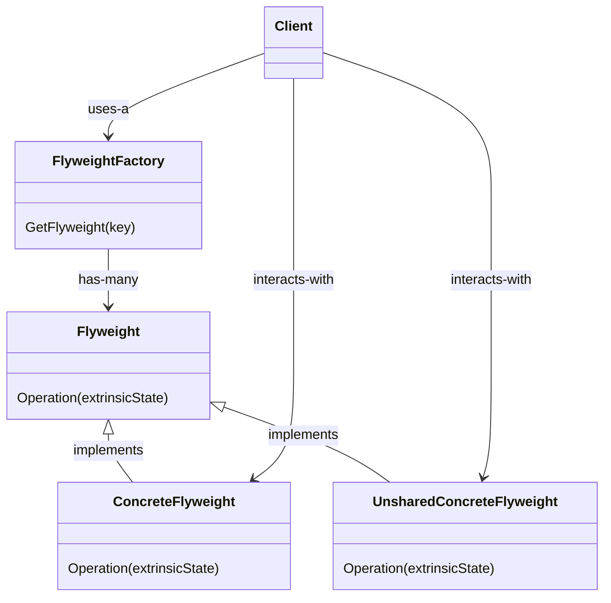

🚧 **This repository is a work in progress. Stay tuned for updates!** 🚧

# Flyweight

Use sharing to support large numbers of fine-grained objects efficiently.

# Structure

```mermaid
classDiagram

class Client

class Flyweight {
    Operation(extrinsicState)
}

class ConcreteFlyweight {
    Operation(extrinsicState)
}

class UnsharedConcreteFlyweight {
    Operation(extrinsicState)
}

class FlyweightFactory {
    GetFlyweight(key)
}

FlyweightFactory --> Flyweight : has-many

Flyweight <|-- ConcreteFlyweight : implements
Flyweight <|-- UnsharedConcreteFlyweight : implements
Client --> ConcreteFlyweight : interacts-with
Client --> UnsharedConcreteFlyweight : interacts-with
Client --> FlyweightFactory : uses-a
```
