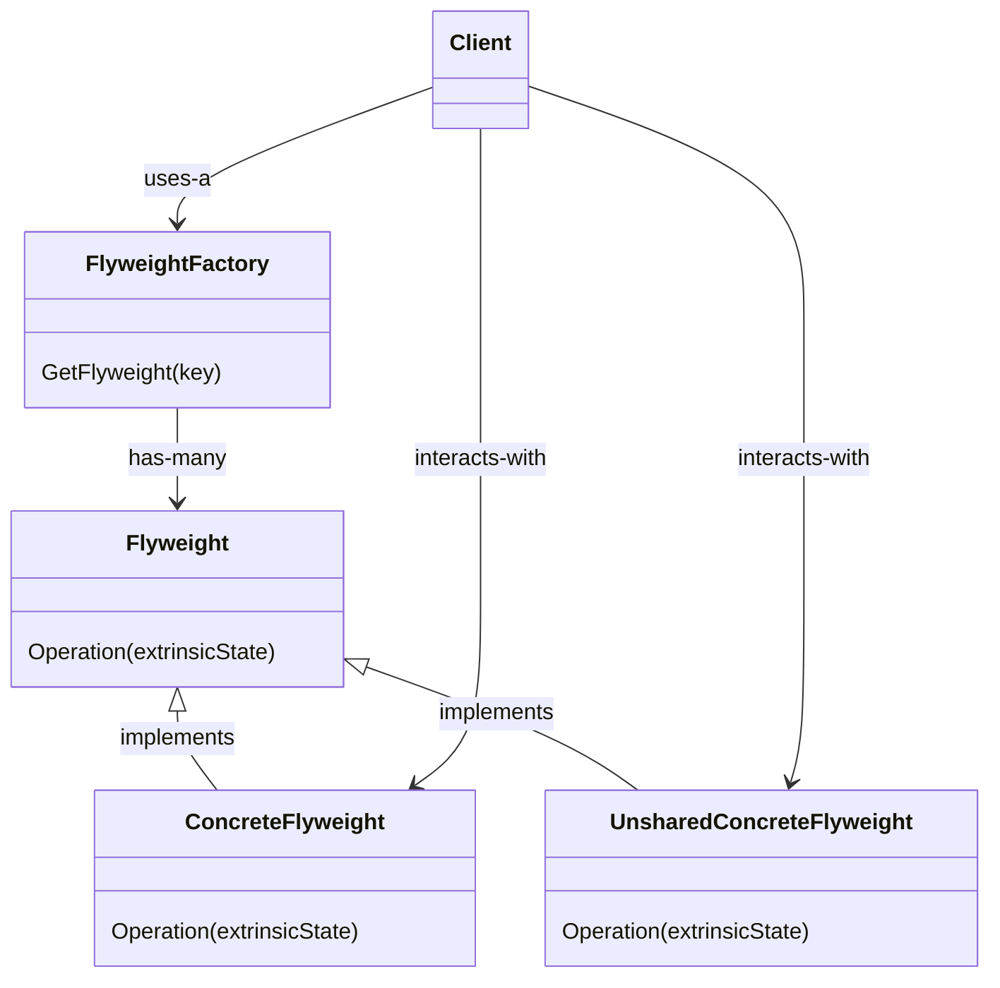

# Flyweight

Use sharing to support large numbers of fine-grained objects efficiently.

# Structure

The class diagram below shows how a flyweight is commonly implemented:

In this structure, the `Client` uses a `FlyweightFactory` to get a flyweight by its key. The factory can decide whether/when to return a `ConcreteFlyweight` or a `UnsharedConcreteFlyweight` based on some decisions regarding intrinsic and extrinsic states. From the client's point of view, though, the way to interact with the flyweight is the same.

## Intrinsic and extrinsic states

Intrinsic state is the internal state of a flyweight. Imagine a text editor where each character is represented by a flyweight, for instance. Intrinsic state in this case would be the `charCode` of the character. Extrinsic state is all the context-dependent information that transcends the boundaries of an object, making it unique at the same time. A character with a different font is a good example of an object with extrinsic state.

## Working example

As the working example for this pattern, the **LandscapeDesign App** app was created. It's a command line tool that allows users to create their landscapes, using trees, houses and colored squares. It implements the **Flyweight pattern** was used in this project as a way of limiting the memory usage when holding references to symbols drawn in the screen. Check out [LandscapeDesign](./LandscapeDesign/) for implementation details.
