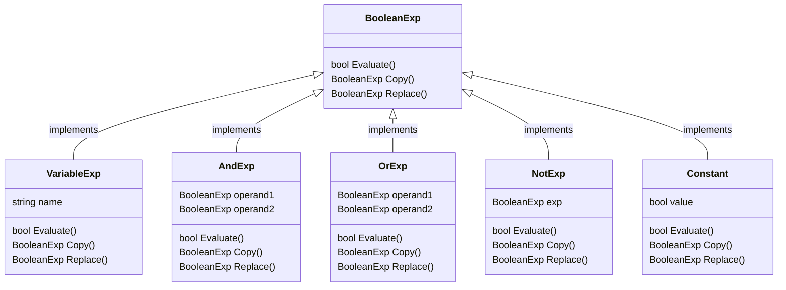

# BoolExParser

BooleanExp ::= VariableExp | Constant | OrExp | AndExp | NotExp | '(' BooleanExp ')'
AndExp ::= BooleanExp 'and' BooleanExp
OrExp ::= BooleanExp 'or' BooleanExp
NotExp ::= 'not' BooleanExp
COnstant ::= 'true' | 'false'
VariableExp ::= 'A' | 'B' | ... | 'X' | 'Y' | 'Z'

