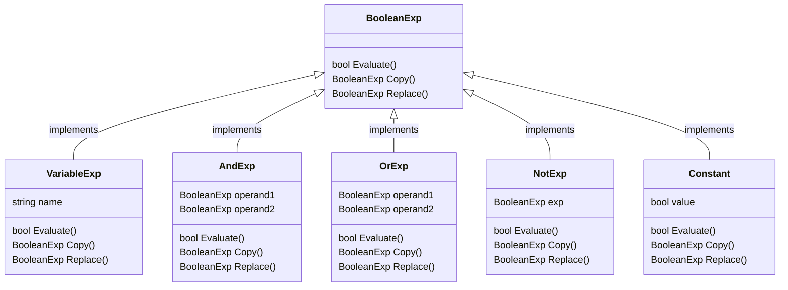

# BoolExParser

BoolExParser is a boolean expression configuration system. It allows clients to create complex boolean operations in a declarative way. Check below some examples of how it can be used:

- Expression: "true"

```csharp
var exp = new Constant(true);
```

- Expression: "not true"

```csharp
var exp = new NotExp(new Constant(true));
```

- Expression: "not x"

```csharp
var exp = new NotExp(new VariableExp('x'));
```

It also allows for composing expressions to create OR (x or y) and AND (y and x) expressions:

```csharp
var yOrX = new OrExp(new VariableExp('x'), new VariableExp('y'));
var yAndX = new AndExp(new VariableExp('x'), new VariableExp('y'));
```

Providing an open-ended range of possibilities.

## Language grammar

A simple grammar was defined for the language:

- `BooleanExp` $::=$ `VariableExp` | `Constant` | `OrExp` | `AndExp` | `NotExp` | '(' `BooleanExp` ')'
- `AndExp` $::=$ `BooleanExp` 'and' `BooleanExp`
- `OrExp` $::=$ `BooleanExp` 'or' `BooleanExp`
- `NotExp` $::=$ 'not' `BooleanExp`
- `Constant` $::=$ `'true'` | `'false'`
- `VariableExp` $::=$ 'a' | 'b' | ... | 'x' | 'y' | 'z'

## The Interpreter Pattern applied

To implement such a flexible structure, the **Interpreter Pattern** was used. As Interpreter is just a particular form of [Composite](../../composite/), but applied to interpret a language, the same aspects of a composite applies. The top-level `Composite` structure in our case is the base interface `BooleanExp`, which defines the methods each composite-compliant class should implement:

```csharp
public interface BooleanExp
{
  public bool Evaluate(Context context);
  public BooleanExp Replace(char name, BooleanExp exp);
  public BooleanExp Copy();
  public string GetName();
}
```

Then, multiple classes implement `BooleanExp` in different ways depending on their particular needs. The class diagram below shows the full class hierarchy:



the classes `VariableExp`, `AndExp`, `OrExp`, `NotExp` are also intermediate composites and therefore delegates most of its behavior to calling the methods on their children, while `Constant` is a leaf, representing a raw boolean value.
