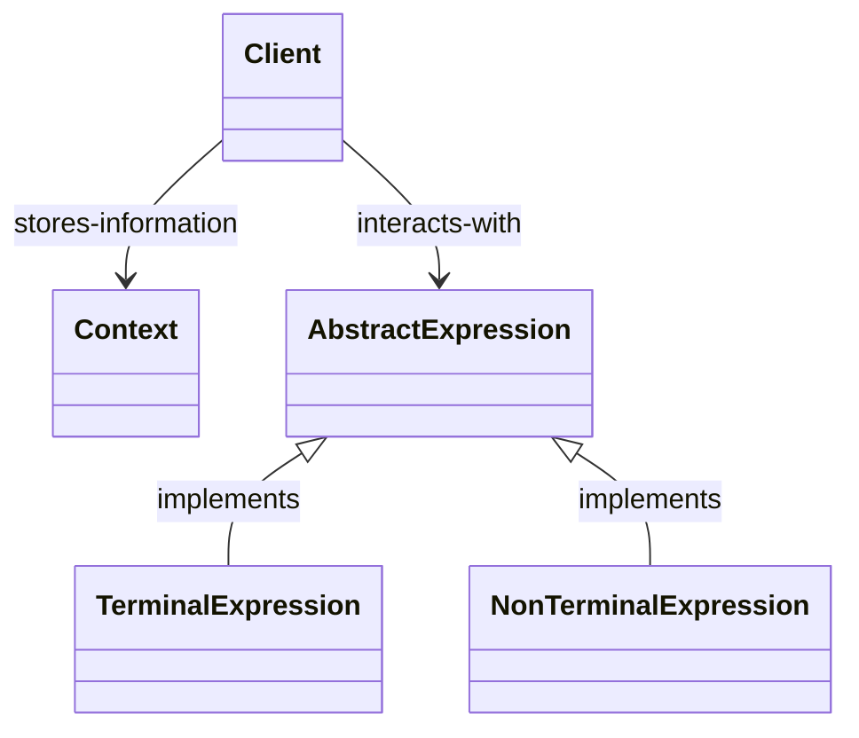

# Interpreter Pattern

Given a language, define a representation for its grammar along with an interpreter that uses the representation to interpret sentences in the language.

## Structure

Find below the usual structure of the interpreter pattern:

A `Client` in this structure generally builds (or is given) an `AbstractExpression` formed with many `TerminalExpression` and `NonTerminalExpression`. As expressions are usually flyweights (see [Flyweight](../flyweight/)), a `Context` is required to store extrinsic information about the expressions. After configuring the context, the client can then execute the `Inspect` operation on the expression in hand, providing it the execution context needed, the result will be the interpretation performed by the language.

## Working example

The working example for this pattern was extracted from GoF's Design Patterns book and is a boolean expression interpreter. It allows for clients to declaratively define complex boolean expressions using subclasses of the `BooleanExp` interface. See [BookExParser](./BoolExParser) for implementation details on what's the project is all about and how the pattern was used in this context.
