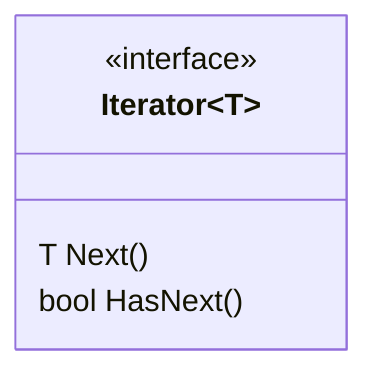

# Iterator

Provides a way to access the elements of an aggregate object sequentially without exposing its underlying representation.

## Structure

## Working example

As our working example, we're going to implement the code for the Kiosk of ObjectvilleFood, a company born from the merge of two restaurants: PancakeHouse and ObjectvilleDiner.

Both restaurants already had their menus implemented in different formats and didn't want to commit to changing their codes, so we've implemented a shared structure for a `MenuItem` and introduced the `Iterator` pattern to help our Kiosk code displaying both menus without worrying about the internals of each of them. To allow for polymorphic iteration we've introduced a `Traversable` interface that defines a `CreateIterator()` factory method, so both menus can implement this interface and return their iterators accordingly. A class library project was created to support the migration: `ObjectvilleFood.Domain`. This project holds the definition for the iterator and traversable interfaces and unifies the definition of the `MenuItem` for both restaurants.
As a bonus (and to prove how much the Kiosk code is easily extensible) yet another menu was incorporated into the Kiosk: The CafeMenu. Make sure to check out the [ObjecvilleFood](./ObjectvilleFood/) project for full implementation details.
