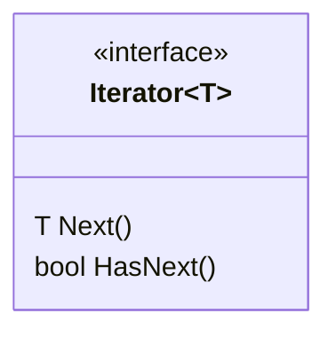

# Iterator

**Book definition:** Provides a way to access the elements of an aggregate object sequentially without exposing its underlying representation.

## Structure

## Working example

As our working example, we're going to implement the code for the Kiosk of ObjectvilleFood, a company born from the merge of two restaurants: PancakeHouse and ObjectvilleDiner.
Both restaurants already had their menus implemented in different formats and didn't want to commit to changing their codes, so we've implemented a shared structure for a `MenuItem` and introduced the `Iterator` pattern to help our Kiosk code displaying both menus without worrying about the internals of each of them.
