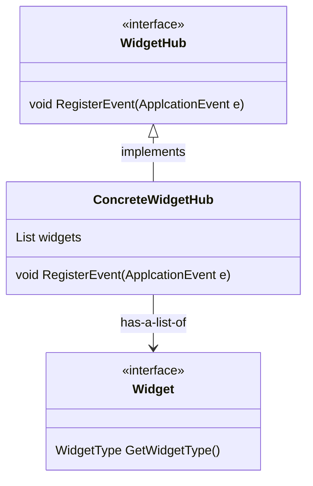
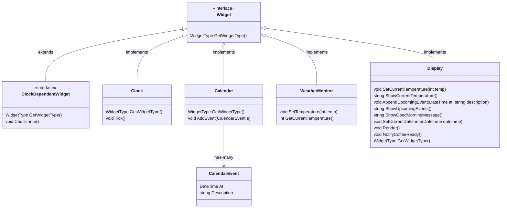
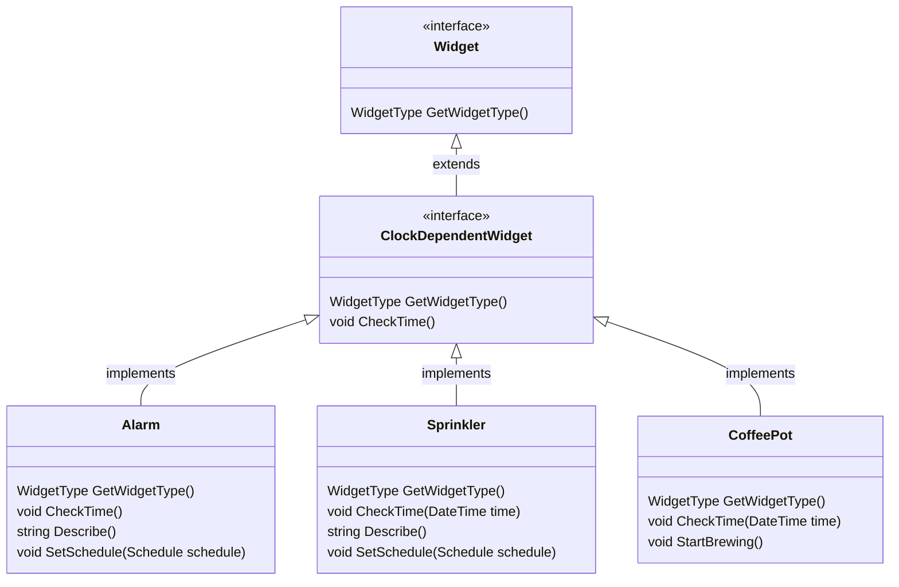

🚧 **This repository is a work in progress at the moment, feel free to look around but please don't expect it to be understandable at this point** 🚧

# House of the future

- WidgetHub class hierarchy and interactions:

- Widget class hierarchy:

- Clock dependent widgets class hierarchy:

## Roadmap

Remaining refactorings and missing things:

- Format notifications list in the console app
- Document console app structure and background processes implementation to handle inputs in a non-blocking fashion

AlarmEvents.ALARM_TRIGGERED:

- Display.ShowAlarmText
- Display.ShowGoodMorningMessage
