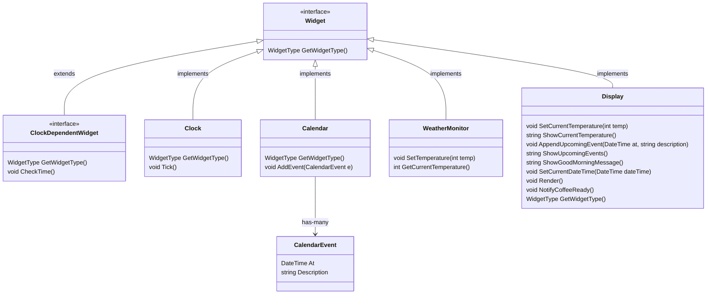
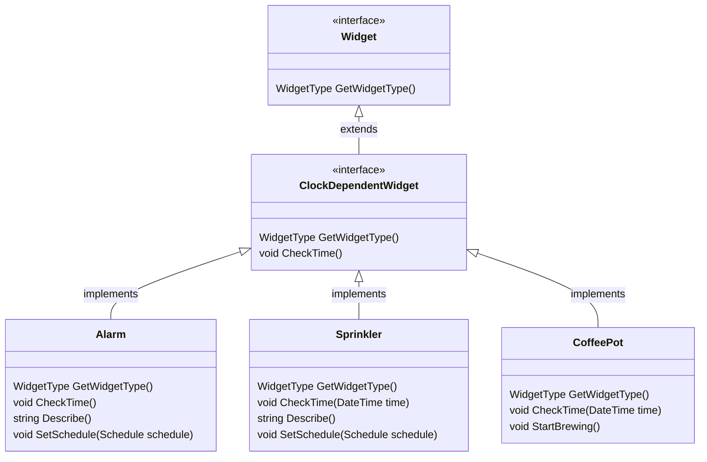
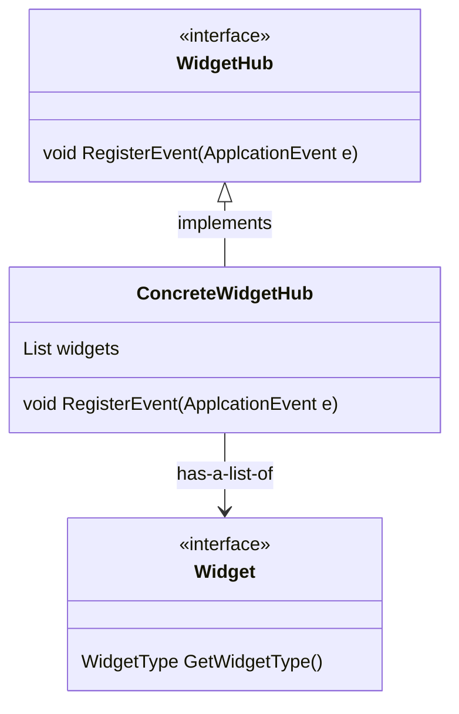

# House of the future

HouseOfTheFuture is a project responsible for managing many connected smart widgets and to deal with their interactions.

## Widgets

A `Widget` in the system is defined as an interface that contains a `GetWidgetType` method, it's defined as follows:

```csharp
public interface Widget
{
  WidgetType GetWidgetType();
}
```

The class diagram below shows how the `Widget` interface is used and its interactions:
The full `Widget` class hierarchy is detailed below:



A sub-interface of `Widget`, the `ClockDependentWidget` interface defines widgets that needs to be clock-bound, i.e., to listen to the `CLOCK_TICK` event. It's defined as follows:

```csharp
public interface ClockDependentWidget : Widget
{
  void CheckTime(DateTime time);
}
```

All Clock dependent widgets and it's interactions are detailed below:



## The Mediator Pattern applied: WidgetHub

To deal with complicated cross-widget interactions, a local, event-based architecture based on the **Mediator Pattern** was implemented, the `WidgetHub` class acts like the central point of contact (mediator) for all registered widgets (colleagues). It keeps track of existing widgets registered to it and knows what to do with each side effect of each [widget event](#application-events) in the system. The `WidgetHub` class hierarchy and its interactions can be seen below:



An example of a complicated interaction between widgets would be the case when we need to start brewing some coffee and to display the alarm text when the alarm is triggered. Without the `WidgetHub` in place to orchestrate these side effects, the `coffeePot` and `display` widgets would be required to know many details regarding the `alarm` widget. The code below shows an example of how this problem is addressed using the `WidgetHub`:

```csharp
class ConcreteWidgetHub {
  // code...
  private void HandleAlarmTriggered(ApplicationEvent e)
  {
    var coffeePot = GetWidgetOrThrowException<CoffeePot>(WidgetType.COFFEE_POT);
    var display = GetWidgetOrThrowException<Display>(WidgetType.DISPLAY);

    coffeePot.StartBrewing();
    display.NotifyAlarmTriggered((string)(e.Data ?? ""));
  }
  // more code...
}
```

## Application events

The `ApplicationEvent` class is the main form of communication between widgets and the widget hub. It's a simple value object containing a generic `Data` object and a `Type`. It's defined as follows:

```csharp
class ApplicationEvent
{
  public readonly Object? Data;
  public readonly ApplicationEventType Type;

  public ApplicationEvent(Object? data, ApplicationEventType type)
  {
    this.Data = data;
    this.Type = type;
  }
}
```

Where each type are one of the following:

```csharp
enum ApplicationEventType
{
  CALENDAR_TICK,
  ALARM_TRIGGERED,
  COFFEE_READY,
  CLOCK_TICK,
  IRRIGATION_STARTED,
  TEMPERATURE_CHANGED,
  NEW_UPCOMING_EVENT
}
```

### Type-casting and safety

When parsing a new application event, the `WidgetHub` sanitizes the `Data` object when applicable, making sure it contains the correct type and the expected data. An example of this approach can be seen below:

```csharp
class WidgetHub {

    // code...

    private void HandleUpcomingEvent(ApplicationEvent e)
    {
    var display = GetWidgetOrThrowException<Display>(WidgetType.DISPLAY);
    var possiblyNullCalendarEvent = e.Data ?? throw new InvalidCalendarEventException();
    var parsedCalendarEvent = (CalendarEvent)e.Data;
    display.AppendUpcomingEvent(parsedCalendarEvent.At, parsedCalendarEvent.Description);
    }

    // more code...
}
```

In the code below, the event is expected to contain a `CalendarEvent` object. To make sure it's true, `e.Data` is being validated and the `InvalidCalendarEventException` exception is thrown in case the validation fails.
