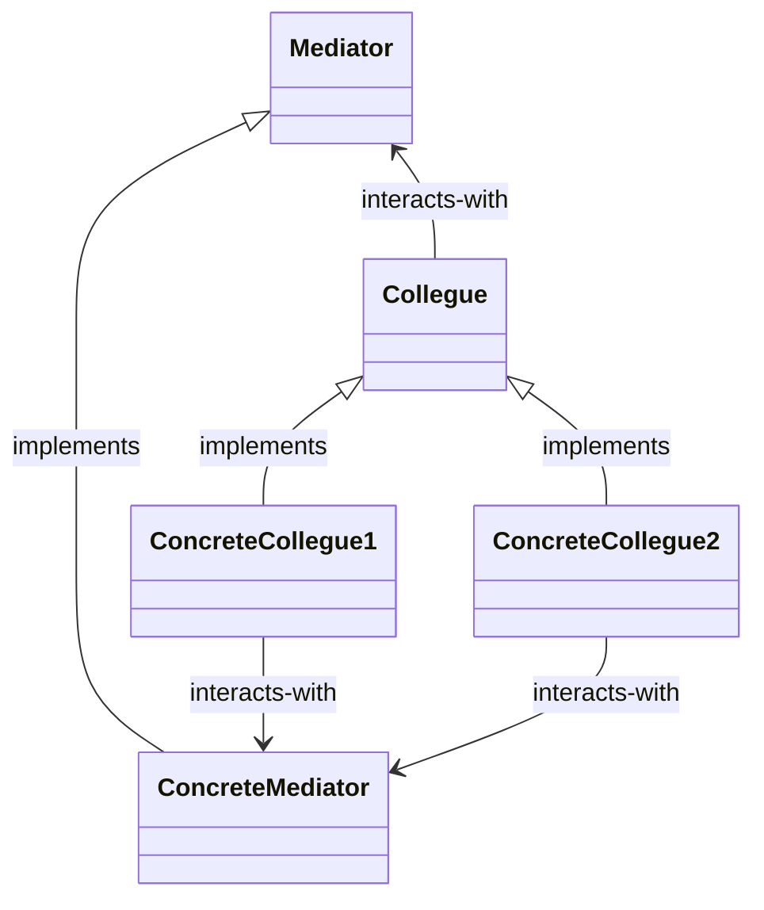

# Mediator Pattern

The **Mediator Pattern** defines an object that encapsulates how a set of objects interact. Mediator promotes loose coupling by keeping objects from referring to each other explicitly, and it lets you vary their interaction independently.

## Structure

Find below the formal structure definition for the mediator pattern:

The `Mediator` acts as a central point of contact between colleagues, therefore allowing for each `Colleague` to only care about their events, not coupling colleagues with each other or even with many others. With this pattern, each colleague only talks to the `Mediator` object, which applies side effects appropriately on every other colleague.

## Working example

The working example for this project was extracted by the brief definition for the Mediator pattern in the **Leftover patterns** sections of the Head-First Design Patterns book. It's a system to manage many connected house widgets, each of them with their specific needs and interactions. The mediator pattern is used in this context to handle cross-widget interaction in a seamless way. Check out [HouseOfTheFuture](./HouseOfTheFuture/) for implementation details and further explanations on the domain.
