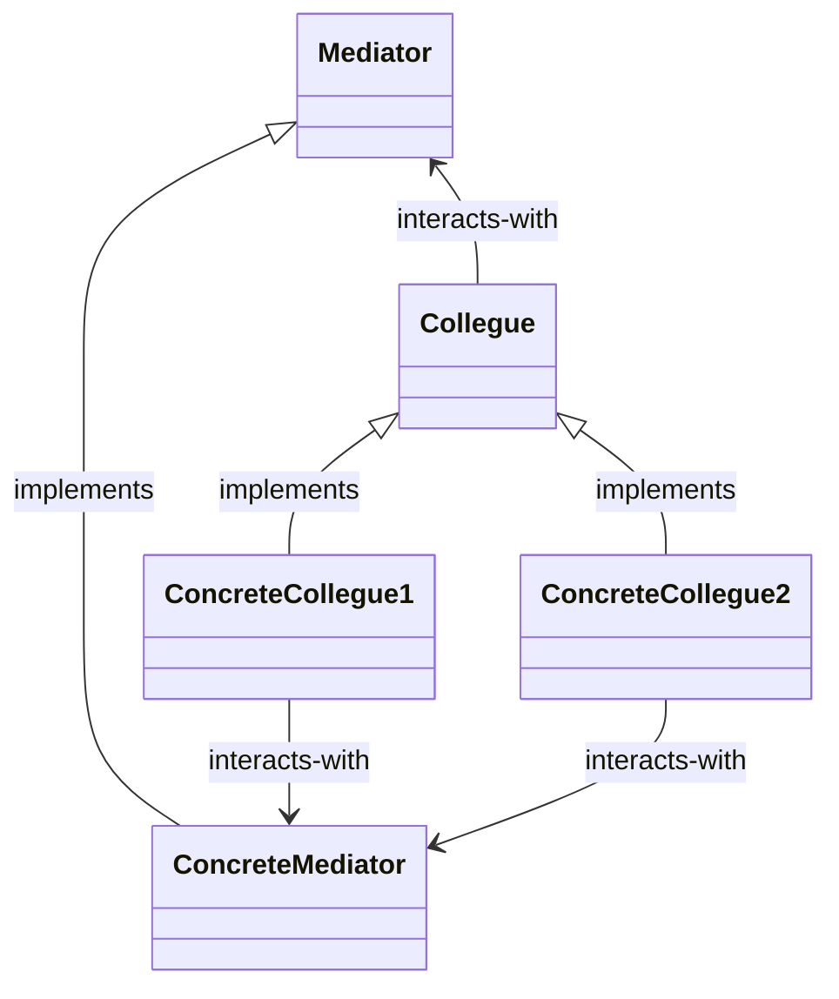

🚧 **This repository is a work in progress at the moment, feel free to look around but please don't expect it to be understandable at this point** 🚧

# Mediator Pattern

The **Mediator Pattern** defines an object that encapsulates how a set of objects interact. Mediator promotes loose coupling by keeping objects from referring to each other explicitly, and it lets you vary their interaction independently.

## Structure

Find below the formal structure definition for the mediator pattern:

## Working example
