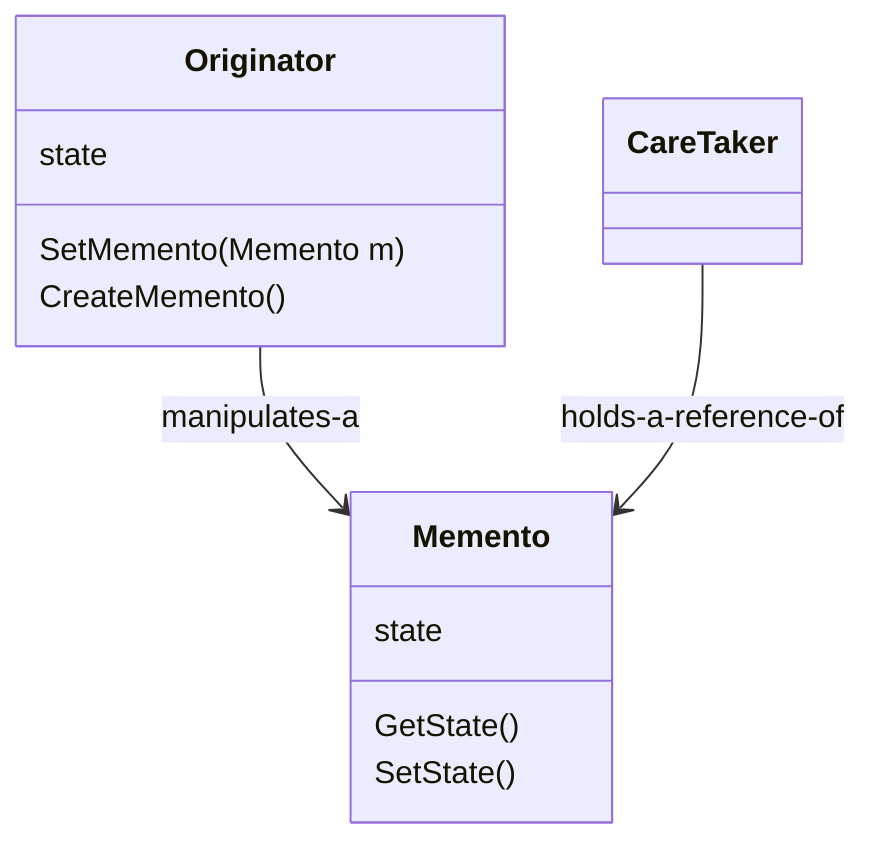
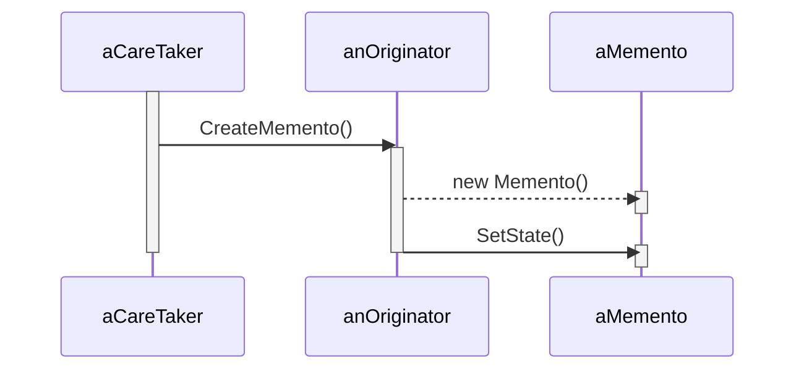
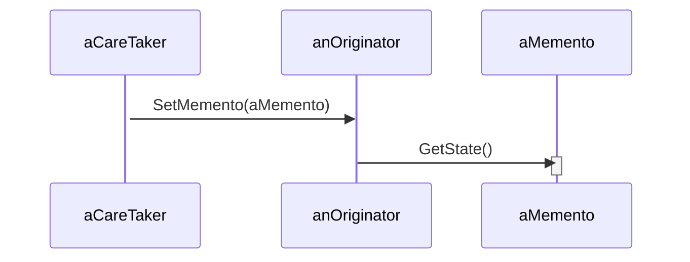

# Memento

Without violating encapsulation, capture and externalize an object's internal state so that the object can be restored to this state later.

## Structure

The formal structure of the Memento pattern can be explained with the class diagram below:

It contains a `Originator` class, which is responsible for creating and updating its own state based on the `Memento`. The `CareTaker` usually manipulates a `Originator`, eventually requesting it to create a snapshot of its state. This snapshot can be kept in memory, for instance, for a certain period of time, and then handed back to the `Originator` to restore its state, using `originator.SetMemento`.

The sequence diagram below shows how `aCareTaker` interacts with `anOriginator` to create `aMemento`:

And after some time, the `careTaker` could request the `originator` to set its state to a previously generated `memento`:

## Working example

The working example for this pattern is a simple Tic Tac Toe game. The game uses the **Memento Pattern** to provide the "undo" functionality for users, allowing to take back a the last move. Check out [TicTacToe](./TicTacToe/) for implementation details.
