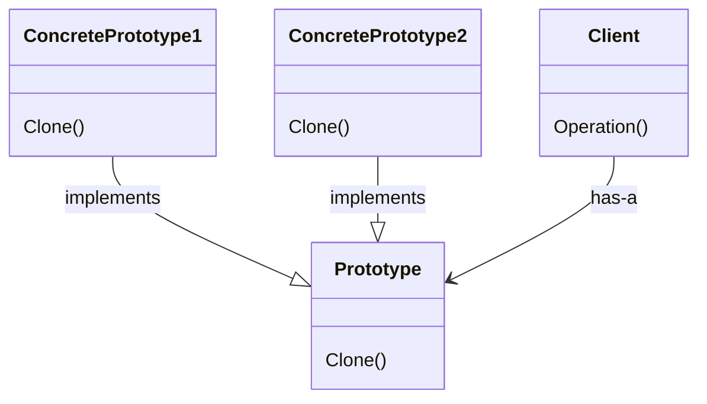

# Prototype Pattern

The prototype pattern provides a way to create copies of objects based on an existing object.

## Structure



A `Client` calls an `Operation()` to `Clone()` an object. Each `ConcretePrototype` implements logic to clone itself. All `ConcretePrototype`s implements the `Prototype` interface.

## How-To

We start with an abstract Prototype class that defines a `Clone()` operation:

```csharp
abstract class Prototype
{
  Clone();
}
```

Concrete subclasses inherit from `Prototype` and override the `Clone()` method to return a copy of themselves:

```csharp
class ConcretePrototype1
{
  Clone() // returns a copy of self
}

class ConcretePrototype2
{
  Clone() // returns a copy of self
}
```

Finally, the client of these prototypes can decide when to clone them:

```csharp
class Client
{
  void Operation()
  {
    this.cmd.Clone();
  }
}
```

## Working example

As our working example, I've implemented a scenario where we want to perform the copy & paste operations over a given text document. The document and its contents are represented by the class `TextDocument`, which inherits from the base, abstract class `Document`. This class has the `Copy` and `Paste` methods defined. We also have the two commands we want to perform, represented as subclasses of the `Command` class: `CopyCommand` and `PasteCommand`. These classes are not going to perform the logic, instead they're going to delegate the call to their receiver: the text document instance itself. The base `Command` class defines a method called `Execute`, which will in fact perform the operation calling the receiver.

The `CopyCommand` class will receive, at the moment of its instantiation, the target document to perform the copying, the position to start the copy and the length to be copied from the target string. Something like this:

```csharp
var copyCmd = new CopyCommand(target: doc, startAt: 0, copyLength: 4);
```

After execution, the `CopyCommand` instance will hold the value of the copied string inside of its `Buffer` property.

The `PasteCommand` class will receive the target doc, the content to be pasted and the position to paste the content. Something like:

```csharp
var pasteCmd = new PasteCommand(
  target: doc,
  contentToPaste: copyCmd.Buffer,
  pastePosition: doc.GetContents().Length
);
```

Make sure to check out the [CopyAndPaste](./CopyAndPaste/) project for full implementation details.
