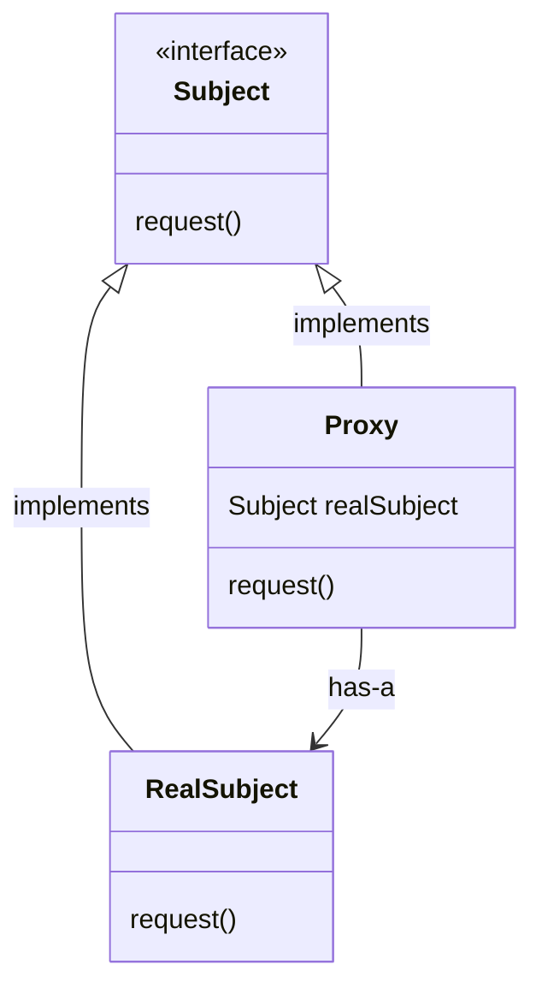
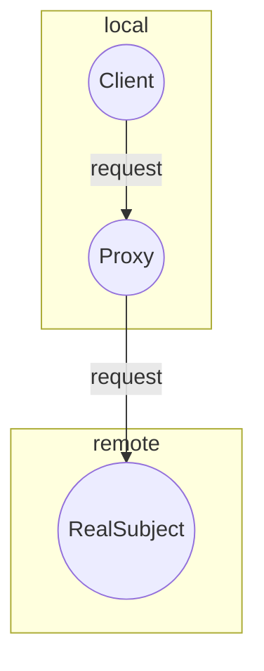
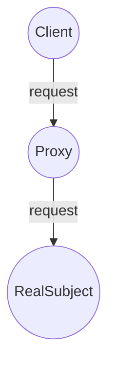

# Proxy

The Proxy Pattern provides a surrogate or placeholder for another object to control access to it. There are many variations of this pattern in the wild, but all of them are variations of these three main types: Remote, Virtual and Protection. Each of these types focuses on a different aspect of its subject and implementation details may vary wildly, but the main intent remains the same: To control access to an object. We will dive into more details in the following sections.

## Structure

- Both the `Proxy` and the `RealSubject` implement the `Subject` interface. This allows any client to treat the `Proxy` just like the `RealSubject`
- The `Proxy` keeps a reference to the `(Real)Subject`, so it can forward requests to the subject when necessary
- The `Proxy` often instantiates or handles the creation of the `RealSubject`
- The `RealSubject` is usually the object that does most of the real work; The `Proxy` controls access to it

## Types of proxy

There are a few different use cases for the Proxy pattern. Here are the definitions and the main differences between each of them:

### Remote Proxy

Acts like a local representative of the `Subject`, but forwards method calls to the `RealSubject` (sitting in a different address space) over the wire behind the scenes.

#### Working example

As the working example for the **Remote Proxy**, an application to create reports for the gumball machines (see the working example at [State Pattern](../state/) for details) was introduced. This application has a `GumballMachineMonitor`, which needs to fetch data from the machine and create reports out of it. The implementation makes the `GumballMachine` implementation behave like a local object, when it's actually located in another address space on the Internet. Please check out [MightyGumball](./MightyGumball) for the complete implementation and additional documentation.

### Virtual Proxy

Acts like a representative for an object that might be expensive to create. The Virtual Proxy often defers the creation of the object until it is needed and acts as a surrogate for the object before and while it is being created. After that, the requests to the `Proxy` are delegated to the `RealSubject`.

#### working example

As the working example for the **Virtual Proxy**, a math application implementing the [Sieve of Eratosthenes](https://en.wikipedia.org/wiki/Sieve_of_Eratosthenes) algorithm. this application's concern is to keep things smooth to the user in cases where the algorithm might take a while to finish computing. To do so, a virtual proxy was introduced in front of the actual calculator. The virtual proxy provides a provisional response to the users while the heavy work happens in the background and, whenever the calculator returns with a result, it replaces this provisional response and places the actual response in the screen. Please check out [Expensive Math](./ExpensiveMath/) for additional documentation and the complete code.

### Protection Proxy

Keeps a reference to the `RealSubject` and forwards all the method calls to it, verifying permission rights where needed.

#### Working example

As the working example for the **Protection Proxy**, a matchmaking application was implemented. This application raises concerns around protecting some setter methods for a `Person`, fields such as name and interests shouldn't be allowed to be changed by someone else. In the same way, the `HotOrNotRating`, which represents the rating of the person inside the app, is not allowed to be changed by the person itself. For further details and the working code, please have a look at [ObjectvilleMatchmaking](./ObjectvilleMatchmaking/).
