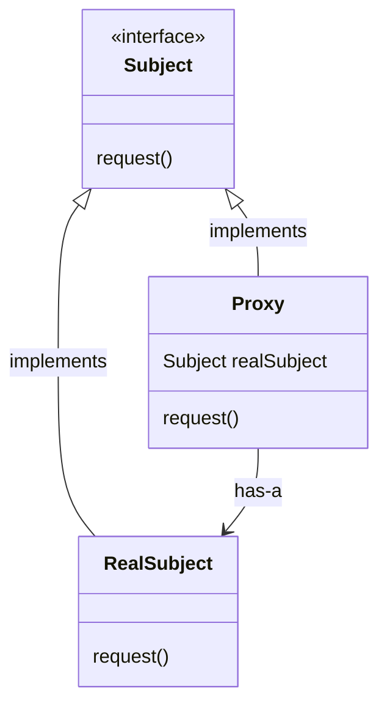
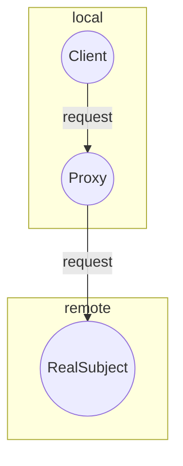
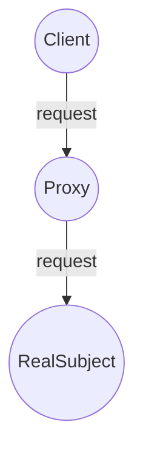

# Proxy

The Proxy Pattern provides a surrogate or placeholder for another object to control access to it.

## Structure



- Both the `Proxy` and the `RealSubject` implement the `Subject` interface. This allows any client to treat the `Proxy` just like the `RealSubject`
- The `Proxy` keeps a reference to the `(Real)Subject`, so it can forward requests to the subject when necessary
- The `Proxy` often instantiates or handles the creation of the `RealSubject`
- The `RealSubject` is usually the object that does most of the real work; The `Proxy` controls access to it

## Types of proxy

There are a few different use cases for the Proxy pattern. Here are the definitions and the main differences between each of them:

### Remote Proxy

Acts like a local representative of the `Subject`, but forwards method calls to the `RealSubject` (sitting in a different address space) over the wire behind the scenes.



### Virtual Proxy

Acts like a representative for an object that might be expensive to create. The Virtual Proxy often defers the creation of the object until it is needed and acts as a surrogate for the object before and while it is being created. After that, the requests to the `Proxy` are delegated to the `RealSubject`.



### Protection Proxy

Keeps a reference to the `RealSubject` and forwards all the method calls to it, verifying permission rights where needed.


## Working example(s)

**Remote Proxy**

The working example for the remote proxy is an application to monitor the current inventory of the gumball machines implemented in the [State Pattern](../state/). This `GumballMachineMonitor` is responsible for creating a report containing the location of the machine and its current inventory of gumballs. The main purpose of this implementation is to demonstrate how remote proxies can stand in for remote objects. To accomplish this, an interface for `GumballMachine` was introduced. This interface contains methods to `GetLocation()` and `GetGumballCount()`. The `GumballMachineMonitor` expects a `GumballMachine` to be passed to its constructor and will use these methods to extract the information needed to create the report. Check out the `GumballMachine` interface below:

```csharp
public interface GumballMachine
{
  string GetLocation();
  int GetGumballCount();
}
```

The key aspect here is that `GumballMachineMonitor` execute the methods in the object received in its constructor as if it is a local object, without worrying about the specifics and the complexities that a remote call brings with it. It is even tested as if the `GumballMachine` were a local object:

```csharp
public class GumballMachineMonitorTest
{
  [Fact]
  public void TestCreateReport()
  {
    var machine = new TestingGumballMachine(location: "Lisbon", gumballCount: 100);
    var monitor = new GumballMachineMonitor(machine);

    var report = monitor.CreateReport();

    Assert.Equal("Gumball Machine: Lisbon | Current Inventory: 100", report);
  }
}
```

At runtime, in our Console app, though, we are instantiating a `RemoteGumballMachine`. This representation, as the name suggests, is an object responsible for communicating to a remotely located machine. It's given an `id` and an `HttpClient` at instantiation time and when `GetLocation()` or `GetGumballCount()` is executed on it, it goes fetch the data over the wire, deserializes the response and returns it to the client, like this:

```csharp
public class RemoteGumballMachine
{
   // some instantiation logic omitted here

   public string GetLocation()
  {
    var resp = this.PerformGetRequest(resource: "location");
    var deserializedResp = JsonSerializer.Deserialize<string>(resp.Content.ReadAsStream());
    return String.IsNullOrEmpty(deserializedResp) ? "" : deserializedResp;
  }

  public int GetGumballCount()
  {
    var resp = this.PerformGetRequest(resource: "gumball-count");
    return Convert.ToInt32(JsonSerializer.Deserialize<string>(resp.Content.ReadAsStream()));
  }

  // some private methods omitted here
}
```

The example code for our console app is:

```csharp
public class Program
{
  public static void Main(string[] args)
  {
    var handler = new StaticHttpClientHandler(new List<string>() { "Lisbon", "100" });
    var machine = new RemoteGumballMachine(id: "lisbon-machine", http: new HttpClient(handler));
    var monitor = new GumballMachineMonitor(machine);

    Console.WriteLine(monitor.CreateReport());
  }
}
```

As it wasn't desirable to go over the wire and fetch some real data for the example, a `StaticHttpClientHandler` was introduced to yield the responses and allow the code to work.

**Note:** Nowadays this kind of implementation is discouraged and can be seen as an anti-pattern. This is due to the complexities and the dangers of remote calls. The recommended practice is to isolate the remote calls in specialized objects and test all the corner cases and possible exceptions thoroughly.

Check out [MightyGumball](MightyGumball/) for the complete implementation.
