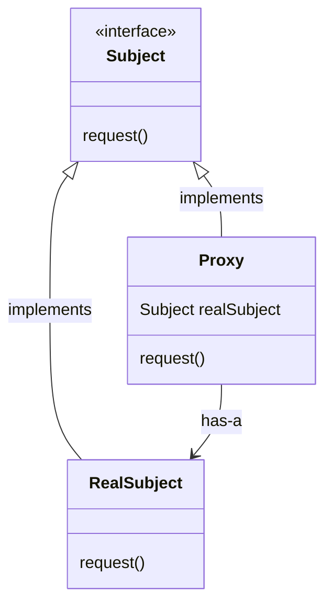
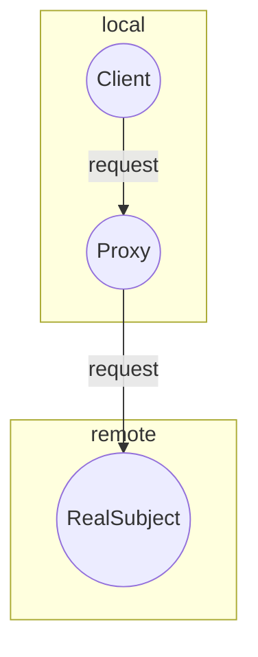
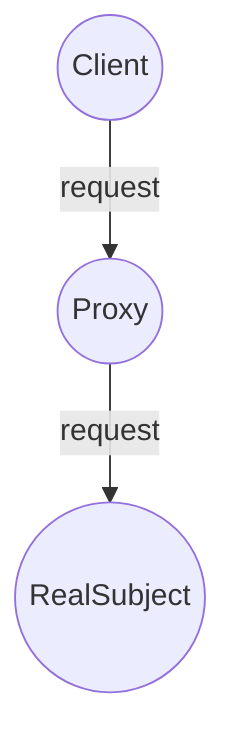

# Proxy

The Proxy Pattern provides a surrogate or placeholder for another object to control access to it.

## Structure

- Both the `Proxy` and the `RealSubject` implement the `Subject` interface. This allows any client to treat the `Proxy` just like the `RealSubject`
- The `Proxy` keeps a reference to the `(Real)Subject`, so it can forward requests to the subject when necessary
- The `Proxy` often instantiates or handles the creation of the `RealSubject`
- The `RealSubject` is usually the object that does most of the real work; The `Proxy` controls access to it

## Types of proxy

There are a few different use cases for the Proxy pattern. Here are the definitions and the main differences between each of them:

### Remote Proxy

Acts like a local representative of the `Subject`, but forwards method calls to the `RealSubject` (sitting in a different address space) over the wire behind the scenes.

### Virtual Proxy

Acts like a representative for an object that might be expensive to create. The Virtual Proxy often defers the creation of the object until it is needed and acts as a surrogate for the object before and while it is being created. After that, the requests to the `Proxy` are delegated to the `RealSubject`.

### Protection Proxy

Keeps a reference to the `RealSubject` and forwards all the method calls to it, verifying permission rights where needed.

## Working example
