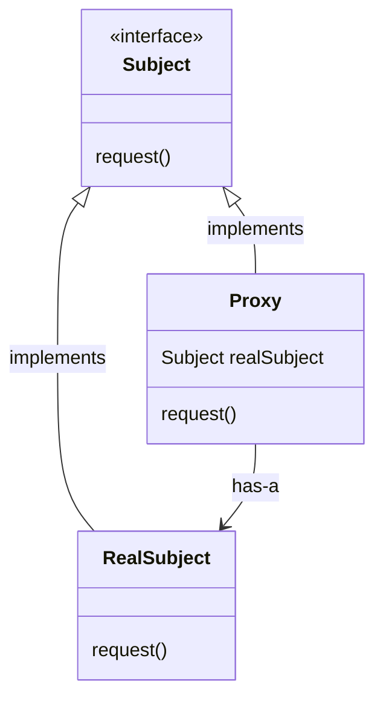
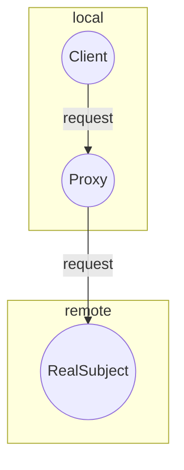
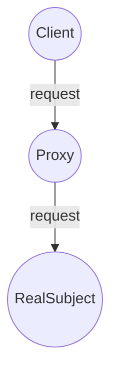

# Proxy

The Proxy Pattern provides a surrogate or placeholder for another object to control access to it. There are many variations of this pattern in the wild, but all of them are variations of these three main types: Remote, Virtual and Protection. Each of these types focuses on a different aspect of its subject and implementation details may vary wildly, but the main intent remains the same: To control access to an object. We will dive into more details in the following sections.

## Structure



- Both the `Proxy` and the `RealSubject` implement the `Subject` interface. This allows any client to treat the `Proxy` just like the `RealSubject`
- The `Proxy` keeps a reference to the `(Real)Subject`, so it can forward requests to the subject when necessary
- The `Proxy` often instantiates or handles the creation of the `RealSubject`
- The `RealSubject` is usually the object that does most of the real work; The `Proxy` controls access to it

## Types of proxy

There are a few different use cases for the Proxy pattern. Here are the definitions and the main differences between each of them:

### Remote Proxy

Acts like a local representative of the `Subject`, but forwards method calls to the `RealSubject` (sitting in a different address space) over the wire behind the scenes.



#### Working example

The working example for the remote proxy is an application to monitor the current inventory of the gumball machines (previously implemented as part of the [State Pattern](../state/)). This `GumballMachineMonitor` is responsible for creating a report containing the location of the machine and its current inventory of gumballs. The main purpose of this implementation is to demonstrate how remote proxies can stand in for remote objects. To accomplish this, an interface for `GumballMachine` was introduced. This interface contains methods to `GetLocation()` and `GetGumballCount()`. The `GumballMachineMonitor` expects a `GumballMachine` to be passed to its constructor and will use these methods to extract the information needed to create the report. Check out the `GumballMachine` interface below:

```csharp
public interface GumballMachine
{
  string GetLocation();
  int GetGumballCount();
}
```

The key aspect here is that `GumballMachineMonitor` execute the methods in the object received in its constructor as if it is a local object, without worrying about the specifics and the complexities that a remote call brings with it. It is even tested as if the `GumballMachine` were a local object:

```csharp
public class GumballMachineMonitorTest
{
  [Fact]
  public void TestCreateReport()
  {
    var machine = new TestingGumballMachine(location: "Lisbon", gumballCount: 100);
    var monitor = new GumballMachineMonitor(machine);

    var report = monitor.CreateReport();

    Assert.Equal("Gumball Machine: Lisbon | Current Inventory: 100", report);
  }
}
```

At runtime, in our Console app, though, we are instantiating a `RemoteGumballMachine`. This representation, as the name suggests, is an object responsible for communicating to a remotely located machine. It's given an `id` and an `HttpClient` at instantiation time and when `GetLocation()` or `GetGumballCount()` is executed on it, it goes fetch the data over the wire, deserializes the response and returns it to the client, like this:

```csharp
public class RemoteGumballMachine
{
   // some instantiation logic omitted here

   public string GetLocation()
  {
    var resp = this.PerformGetRequest(resource: "location");
    var deserializedResp = JsonSerializer.Deserialize<string>(resp.Content.ReadAsStream());
    return String.IsNullOrEmpty(deserializedResp) ? "" : deserializedResp;
  }

  public int GetGumballCount()
  {
    var resp = this.PerformGetRequest(resource: "gumball-count");
    return Convert.ToInt32(JsonSerializer.Deserialize<string>(resp.Content.ReadAsStream()));
  }

  // some private methods omitted here
}
```

The example code for our console app is:

```csharp
public class Program
{
  public static void Main(string[] args)
  {
    var handler = new StaticHttpClientHandler(new List<string>() { "Lisbon", "100" });
    var machine = new RemoteGumballMachine(id: "lisbon-machine", http: new HttpClient(handler));
    var monitor = new GumballMachineMonitor(machine);

    Console.WriteLine(monitor.CreateReport());
  }
}
```

As it wasn't desirable to go over the wire and fetch some real data for the example, a `StaticHttpClientHandler` was introduced to yield the responses and allow the code to work.

**Note:** Nowadays this kind of implementation is discouraged and can be seen as an anti-pattern. This is due to the complexities and the dangers of remote calls. The recommended practice is to isolate the remote calls in specialized objects and test all the corner cases and possible exceptions thoroughly.

Check out [MightyGumball](MightyGumball/) for the complete implementation.

### Virtual Proxy

Acts like a representative for an object that might be expensive to create. The Virtual Proxy often defers the creation of the object until it is needed and acts as a surrogate for the object before and while it is being created. After that, the requests to the `Proxy` are delegated to the `RealSubject`.



#### working example

The working example for the virtual proxy is an application that implements the [Sieve of Eratosthenes](https://en.wikipedia.org/wiki/Sieve_of_Eratosthenes) algorithm. This algorithm counts the number of prime numbers from 2 up to a given `n`. As it's imaginable, this computation might take a long time to complete, depending on the size of `n`. So, to make things smooth for the users, a virtual proxy was used to stand in for a `SieveOfEratosthenesCalculator` subject and return a provisional response while the computation is done at the background. As soon as a response arrives, the `SieveOfEratosthenesCalculator` will replace this provisional response with the actual list of prime numbers found.
To accomplish this, a `SieveOfEratosthenes` interface was introduced, with a method to `PrintPrimeCountUpTo(int n)`. This interface looks like this:

```csharp
namespace ExpensiveMath.Algorithms;

public interface SieveOfEratosthenes
{
  void PrintPrimeCountUpTo(int n);
}
```

And it's implemented by both `SieveOfEratosthenesCalculator` and `SieveOfEratosthenesProxy`.

The proxy's implementation keeps a reference to the real subject (i.e. `SieveOfEratosthenesCalculator`) and, whenever `PrintPrimeCountUpTo` is called, prints a message to the console saying that a result is being processed and starts a `Thread` to perform the heavy work in the background:

```csharp
public class SieveOfEratosthenesProxy : SieveOfEratosthenes
{
  private SieveOfEratosthenesCalculator calculator;

  public SieveOfEratosthenesProxy(SieveOfEratosthenesCalculator calculator)
  {
    this.calculator = calculator;
  }

  public void PrintPrimeCountUpTo(int n)
  {
    Console.WriteLine("Processing...");
    var thread = new Thread(() =>
    {
      Console.SetCursorPosition(0, Console.CursorTop);
      Console.Write(new string(' ', Console.WindowWidth));
      Console.SetCursorPosition(0, Console.CursorTop - 1);
      this.calculator.PrintPrimeCountUpTo(n);
    });

    thread.Start();
    thread.Join();
  }
}
```

The calculator's implementation contains the heavy work of computing the prime numbers:

```csharp
public class SieveOfEratosthenesCalculator : SieveOfEratosthenes
{
  protected List<int> GetPrimesUpTo(int limit)
  {
    var list = new List<int>();
    var crossedOutItems = new List<int>();
    for (int i = 2; i <= limit; i++)
    {
      list.Add(i);
    }

    list.ForEach(n =>
    {
      var result = n;
      var currentPosition = 0;
      while (result < limit && !crossedOutItems.Contains(n))
      {
        result = n * list[currentPosition];
        crossedOutItems.Add(result);
        currentPosition++;
      }
    });

    return list.Where(i => !crossedOutItems.Contains(i)).ToList();
  }

  public void PrintPrimeCountUpTo(int n)
  {
    var result = this.GetPrimesUpTo(n);
    Console.WriteLine($"Result {result.Count.ToString()}");
  }
}

```

Then, at the presentation layer, a `MathUI` interface was introduced to interact with the user and capture the input value for `n`:

```csharp
public class MathUI
{
  private SieveOfEratosthenes calculator;

  public MathUI(SieveOfEratosthenes calculator)
  {
    this.calculator = calculator;
  }

  public void Run()
  {
    Console.WriteLine("Type the number you want to print primes up to:");
    Console.Write("> ");
    var limit = Convert.ToInt32(Console.ReadLine());
    this.calculator.PrintPrimeCountUpTo(limit);
  }
}
```

And finally, when instantiating `MathUI`, we give it an instance of the proxy instead one for the real subject:

```csharp
public class Program
{
  public static void Main(string[] args)
  {
    var ui = new MathUI(new SieveOfEratosthenesProxy(
      calculator: new SieveOfEratosthenesCalculator()
    ));

    ui.Run();
  }
}

```

Now, whenever the UI is executed and the user enters a number, the proxy implementation will take place and print "Processing..." until a response is ready to be printed.

Check out [ExpensiveMath](./ExpensiveMath/) for the implementation details and a complete view of the project.

### Protection Proxy

Keeps a reference to the `RealSubject` and forwards all the method calls to it, verifying permission rights where needed.


