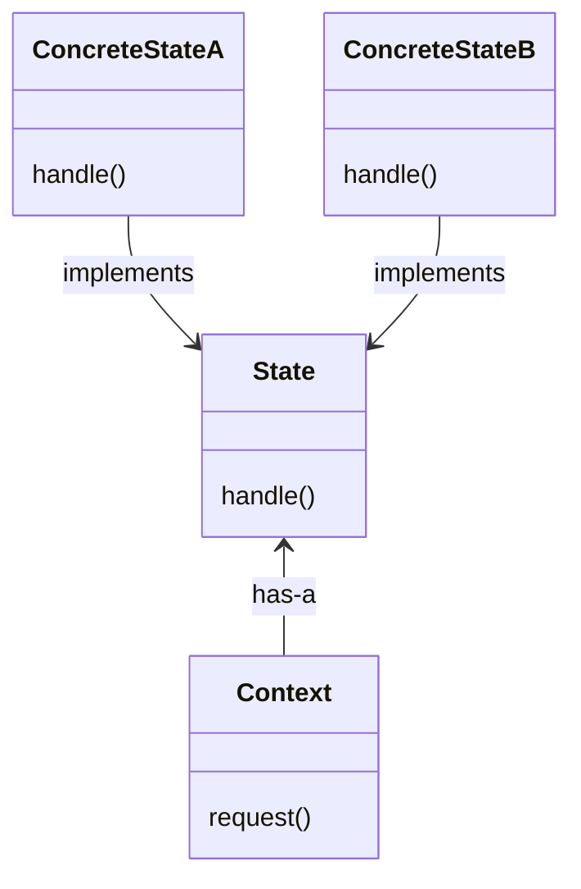

# State Pattern

**Book definition** The **State Pattern** allows an object to alter its behavior when its internal state changes. The object will appear to change its class.

## Structure

## Working example

As our working example we are going to implement a Gumball Machine. This machine can have the following states: `NO_QUARTER`, `HAS_QUARTER`, `SOLD`, `SOLD_OUT` and `WINNER`. Some of these states are only transitional ones and will move the machine to the next state after performing their work. There are some actions available to trigger the change of state, such as `InsertQuarter()` and `TurnCrank()`. The `WINNER` state is calculated when selling the gumball. To reach this state, the customer must be lucky to be one of the 10% of people who are going to get 2 gumballs dispensed by the machine instead of one.
