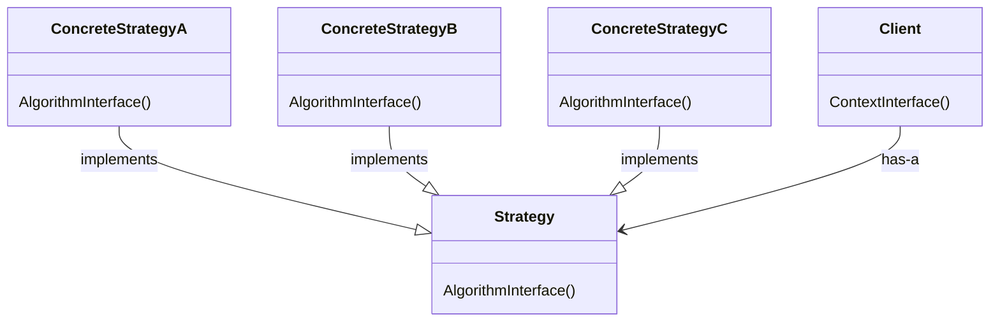

# Strategy pattern

The strategy pattern provides a way to allow classes to use an algorithm without knowing the implementation details of it.

Each algorithm is encapsulated as a concrete subclass of the `Strategy` abstract class, overriding its `operation` method to match its needs.

## Structure



A `Client` has a `Strategy` to use on `ContextInterface()`, the `ContextInterface()` method calls the `AlgorithmInterface()` on the `Strategy` instance, without knowing which specific algorithm is being used. Each `ConcreteStrategy` implements a different `AlgorithmInterface()`.

## How-To

- The strategy interface:

```csharp
interface Strategy
{
  int AlgorithmInterface();
}
```

- The concrete strategies:

```csharp
class ConcreteStrategyA : Strategy
{
  int AlgorithmInterface()
  {
    // implementation
  }
}

class ConcreteStrategyB : Strategy
{
  int AlgorithmInterface()
  {
    // implementation
  }
}

class ConcreteStrategyC : Strategy
{
  int AlgorithmInterface()
  {
    // implementation
  }
}
```

- The client:

```csharp
class Client
{
  void ContextInterface(Strategy strategy)
  {
    var algoResult = strategy.AlgorithmInterface();
  }
}
```

- At runtime:

```csharp
var client = new Client();
var resultA = client.ContextInterface(new ConcreteStrategyA());
var resultB = client.ContextInterface(new ConcreteStrategyB());
var resultC = client.ContextInterface(new ConcreteStrategyC());
```

## Working example

As the working example I expanded the `Renderable` interface presented in the "Composite Pattern" project to allow multiple rendering formats. The `FormattingStrategy` interface was introduced to represent the formatting strategies.

Now, the `Renderable.Render` method expects a parameter specifying the formatting strategy to be used to render the text value. Two formatting strategies were created: `PlainTextFormatter` and `HTMLTextFormatter`, both of them inherit from `Formatter`, which has a default implementation.
