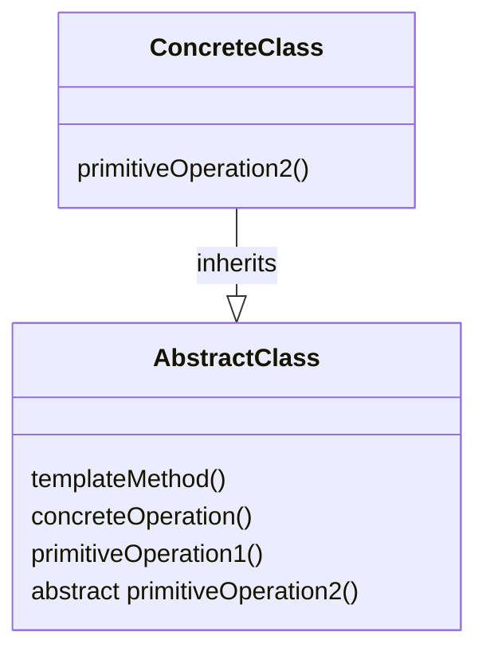

# Template method

**Book definition**: Defines the skeleton of an algorithm in a method, deferring some steps to subclasses. Template Method lets subclasses redefine certain steps of an algorithm without changing the algorithm's structure.

## Structure

- The `AbstractClass` contains the template method and abstract versions of the operations used in the template method; It also holds the implementation of the `concreteOperation`s;
- The `templateMethod` makes use of the `primitiveOperation`s and `concreteOperation`s to implement an algorithm. It's decoupled from the actual implementation of these operations
- The `ConcreteClass` implements the abstract operations, which are called when the `templateMethod()` needs them
- There may be many `ConcreteClass`es, each implementing the full set of operations required by the template method

## Working example
