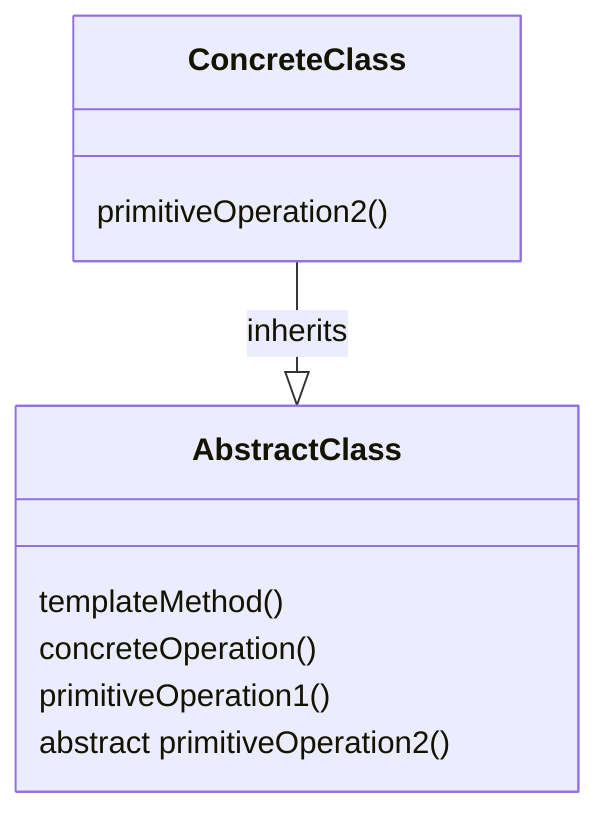

# Template method

**Book definition**: Defines the skeleton of an algorithm in a method, deferring some steps to subclasses. Template Method lets subclasses redefine certain steps of an algorithm without changing the algorithm's structure.

## Structure



- The `AbstractClass` contains the template method and abstract versions of the operations used in the template method; It also holds the implementation of the `concreteOperation`s;
- The `templateMethod` makes use of the `primitiveOperation`s and `concreteOperation`s to implement an algorithm. It's decoupled from the actual implementation of these operations
- The `ConcreteClass` implements the abstract operations, which are called when the `templateMethod()` needs them
- There may be many `ConcreteClass`es, each implementing the full set of operations required by the template method

## Working example

As our working example we will be revisiting our Starbuzz Coffee example first introduced as the working example of the [Decorator Pattern](../decorator/). In this implementation we needed to control the way the caffeine-based beverages (e.g. `Coffee` and `Tea`) are prepared. We wanted to make sure all the steps are followed correctly but also allow some flexibility for the subclasses to implement some details for themselves. The flier with recipe instructions below is our starting point:

```text
+-------------------------------------------------+
| Starbuzz Coffee Barista Training Manual         |
| Baristas! Please follow these recipes precisely |
| when preparing Starbuzz beverages.              |
|                                                 |
| Starbuzz Coffee Recipe                          |
| (1) Boil some water                             |
| (2) Brew coffee in boiling water                |
| (3) Pour coffee in cup                          |
| (4) Add sugar and milk                          |
|                                                 |
| Starbuzz Tea Recipe                             |
| (1) Boil some water                             |
| (2) Brew tea in boiling water                   |
| (3) Pour tea in cup                             |
| (4) Add lemon                                   |
|                                                 |
+-------------------------------------------------+
```

Notice how steps 1 and 3 are the same, and steps 2 and 4 are similar in terms of proceedings.