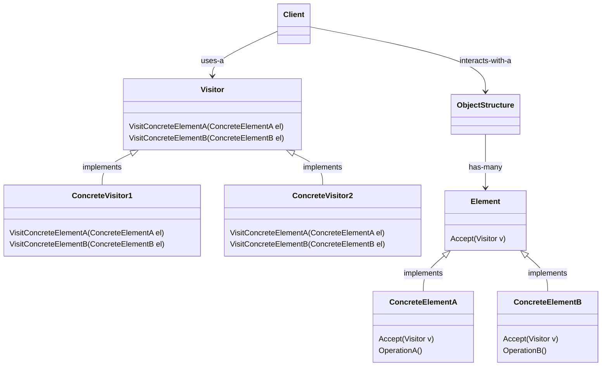
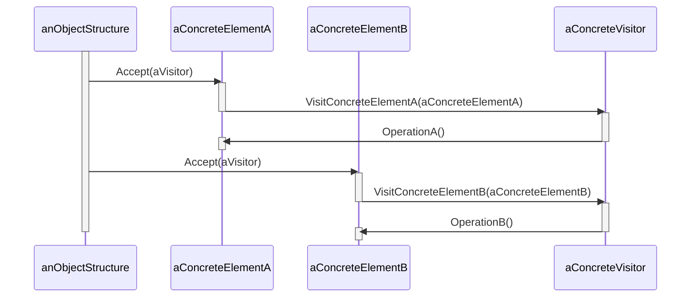

# Visitor

Represents an operation to be performed on the elements of an object structure. Visitor lets you define a new operation without changing the classes of elements on which it operates.

## Structure

The formal structure for the visitor pattern has many moving parts. The class diagram below shows how these parts interact with each other:

Considering the structure above, a `Client` usually acts as a `Traverser` over a given `ObjectStructure`, providing one or more `Visitor` instances to it. Each `ConcreteElement` implements a method to `Accept` a visitor and calls `VisitConcreteElementX` on the `Visitor`, hinting at the concrete element's class. Then the visitor, knowing from which concrete class it was invoked, executes the operation it wants on the concrete class. The sequence diagram below helps understanding this flow:

Visitors are useful when we want to extend the behavior of a class hierarchy without "polluting" the related classes with more code. It's specially helpful when working with composites.

## Working example

The working example for this pattern is built on top of what we've done for the [Composite Pattern](../composite), where we had a composite structure formed by `MenuComponent` subclasses. Here we've implemented a `Visitor` class hierarchy, containing two visitors: `HealthInformationVisitor` and `MacroNutrientsVisitor`, these two, as the name suggests, are responsible for gathering information regarding health score and macro nutrients info for all menu items. Check out [ObjectvilleFood](./ObjectvilleFood/) for implementation details and further explanations.
